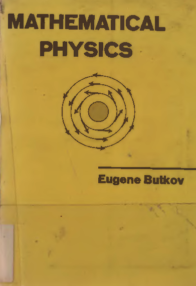
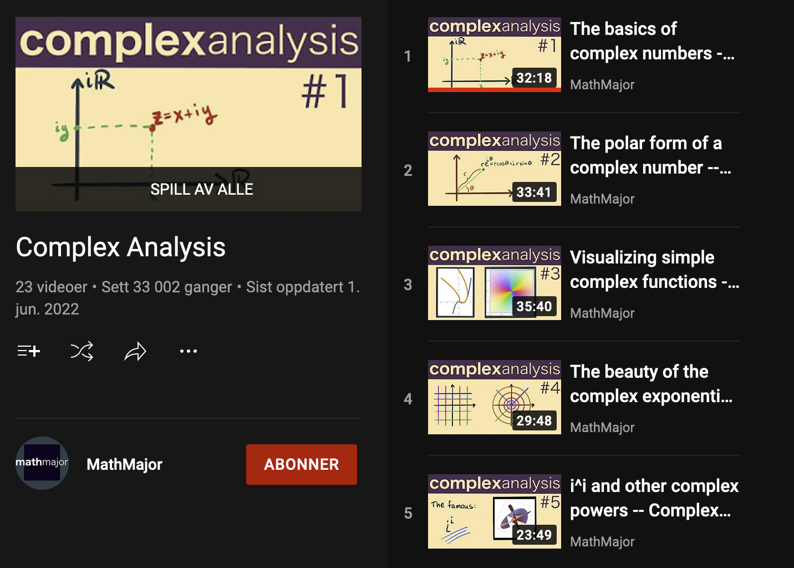
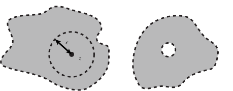
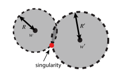
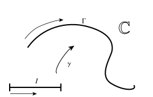
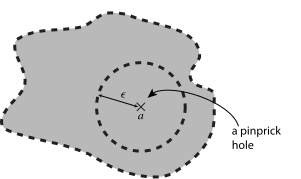

# Complex analysis

## Complex algebra

Complex numbers go back to the 16th century, when one tried to solve polynomial root equations. Some equations, like $x^2 + 1= 0$, did not have roots. On the other hand, by pretending that it *does* have roots, let's call them $\sqrt{-1}$, which was absurd at the time, the Italian mathematician R. Bombelli (ca. 1560) showed that if one used such numbers systematically, one could come up with algorithms for finding roots that were actually real! For example, the equation $x^3 = 15x + 4$ has $4$ as a root, which Bombelli found as $$4 = \sqrt[3]{2 + \sqrt{-121}} + \sqrt[3]{2 - \sqrt{-121}}.$$ Descartes famously dubbed the square root of negative numbers *imaginary*, as he seemed to think they did not "exist" like the real numbers. The name stuck, and L. Euler himself coined the notation $$\mathrm{i}= \sqrt{-1}.$$

However, the Norwegian mathematician and cartographer C. Wessel was the first to discover the geometric interpretation of complex numbers as vectors in the plane, around 1797.

Today, complex numbers are everywhere. They are useful in real analysis too: The fundamental Theorem of Algebra, convergence theory of Taylor series, et.c.

For the quantum chemist *why* learn complex analysis?

Quantum mechanics is complex-valued, so complex numbers are a natural tool. Analytic functions pop up in many situations. Many of the integrals quantum chemists deal with every day have a natural setting in complex analysis. Complex functions are useful for wave phenomena and oscillations in general, since using complex exponentials, a traveling wave obtains a very transparent form, $$\cos(kx - \omega t) = \operatorname{Re}\exp(\mathrm{i}(kx-\omega t)).$$

In short, complex analysis deals with *differentiable complex functions*. Such functions turn out to be much more than differentiable: they are *infinitely* differentiable, and they can be expanded locally in power series. Hence, "analytic". Moreover, their singularity structire is very rigid, and integration of such functions have many surprising and useful properties. For example, integration of rational functions become straightforward.

::: {.recommended-reading}

{.recommended-reading-cover fig-alt="Book or resource cover"}

This is an excellent and modern textbook in complex analysis, and an engaging read.

:::

::: {.recommended-reading}

{.recommended-reading-cover fig-alt="Book or resource cover"}

This book from 1968 is a classic in mathematical physics. It is not a rigorous mathematics book, but gives you many of the tools of the trade. There are also many interesting problems.

:::

::: {.recommended-reading}

{.recommended-reading-cover fig-alt="Book or resource cover"}

The YouTube channel MathMajor of Michael Penn of Randolph College, Virginia, contains excellent videos on many mathematics topics, and in particular on complex analysis. <https://www.youtube.com/playlist?list=PLVMgvCDIRy1wzJcFNGw7t4tehgzhFtBpm>

:::

::: {#def-complex-number-operations}

## Complex number operations

Let $z = x + \mathrm{i}y \in \mathbb{C}$.

- $\operatorname{Re}z = x$, $\operatorname{Im}z = y$ *real and imaginary part*

- $\bar{z} = z^* = x - \mathrm{i}y$ *complex conjugate*

- $z = r e^{i\theta}$, *polar form*\
  where $e^{\mathrm{i}\theta} = \cos\theta + \mathrm{i}\sin\theta$ *Euler's formula*

- $\operatorname{Arg}z = \theta$ *argument/angle/phase*

- $|z|^2 = \bar{z}z = \operatorname{Re}z^2 + \operatorname{Im}z^2 = r^2$ *squared modulus/norm*

:::

The complex plane can be regarded as $\mathbb{R}^2$. Indeed, the modulus $|z| = \sqrt{(\operatorname{Re}z)^2 + (\operatorname{Im}z)^2}$ is the Euclidean norm in $\mathbb{R}^2$.

Recall that an $\epsilon$-ball in $\mathbb{R}^2$ is a small disc centered at some $(x,y)$ with radius $\epsilon$, excluding its boundary. Thus, convergence of sequences, continuity, the same as in $\mathbb{R}^2$

Throughout, we let $D \subset \mathbb{C}$ be an open domain, i.e., every point $z \in D$ is surrounded by some $\epsilon$-ball.

A *simply connected* domain is one without any holes. @fig-complex-domain.

{#fig-complex-domain}

Let $f : \mathbb{C}\to \mathbb{C}$ be a function. By writing $f(z) = u(x,y) + \mathrm{i}v(x,y)$, we can regard $f$ a s a *pair* of real-valued functions defined in the plane region $D$.

$$f(z) \quad \leftrightarrow  \quad u(x,y) + \mathrm{i}v(x,y).$$ What are the properties of such functions? What is distinguishes functions like $$f(z) = z^3 + 1, \quad f(z) = \frac{1}{1 - z},$$ from functions like $$f(z) = \operatorname{Re}z + \operatorname{Im}z \quad ?$$ The first function is clearly a function of the combination $z = x + \mathrm{i}y$, and not of $x$ and $y$ individually. In an intuitive sense, the first function is "purer" than the second one, it is a "true function of $z$".

It is useful to note that $$\operatorname{Re}z = \frac{1}{2}(z + \bar{z}), \quad \operatorname{Im}z = \frac{1}{2\mathrm{i}} (z - \bar{z}).$$ Thus, seemingly $z$ and $\bar{z}$ are like independent variables.

Thus, we can rewrite any occurence of $\operatorname{Re}z$ and $\operatorname{Im}z$ in terms of $z$ and $\bar{z}$, i.e., the latter can be used as independent variables (even if they are, strictly speaking, not! When $z$ changes, so do $\bar{z}$!) For example, $$f(z) = \operatorname{Re}z + \operatorname{Im}z = (\frac{1}{2} + \frac{1}{2\mathrm{i}}) z + (\frac{1}{2} - \frac{1}{2\mathrm{i}}) \bar{z}.$$ It now looks like $f(z)$ is not a "pure" function of $z$.

Indeed, it turns out that the "pure" functions are the differentiable ones, while the "mixed" functions are never differentiable. And the "pure" functions are always extremely well-behaved!

::: {#exm-example-15}

## Example

The perhaps simplest complex functions, and among the most important, are *polynomials* $$p(z) = a_0 + a_1 z + a_2 z^2 + \cdots + a_n z^n.$$ The degree of the polynomial is the index of the larges nonzero coefficient $a_n \in \mathbb{C}$. The polynomials are the simplest complex differentiable functions, from which much is derived.

:::

::: {#thm-fundamental-theorem-of-algebra-2}

## Fundamental Theorem of Algebra

Any polynomial of degree $n$ can be factorized uniquely (up to reordering of the roots $r_i$) as $$p(z) = c (z-r_1)(z-r_2)\cdots(z-r_n).$$

:::

## Complex differentiability

Complex differentiability is defined in a similar manner as real single-variable differentiability:

::: {#def-complex-differentiability}

## Complex differentiability

The function $f : U \to \mathbb{C}$, $U \subset^{\text{open}} \mathbb{C}$, is (complex) differentiable at $z \in U$ if the limit $$\lim_{h \to 0} \frac{f(z+h) - f(z)}{h} = f'(z) = \frac{\mathrm{d} f}{\mathrm{d} z}$$ exists. The expression $h\to 0$ means the same as in the $\mathbb{R}^2$ case.

If $D$ is an open domain in $\mathbb{C}$, and if $f(z)$ is complex differentiable for all $z \in D$, we say that $f$ is *analytic in $D$*.

:::

The fact that the limit is to exist as $h\to 0$ in the complex sense is *much more restrictive* than the previous limit for real functions from $\mathbb{R}^2\to\mathbb{R}^2$. Not only can one approach $0$ from any direction, but the rules of complex multiplication must also be obeyed.

::: {#exm-derivative-of-monomial}

## Derivative of monomial

Let us apply the definition of the derivative to $f(z) = z^n$. $$f(z+h) = (z+h)^n = z^n + h n z^{n-1} + \text{higher order terms}.$$ Thus $$\frac{f(z+h)-f(z)}{h} = \frac{h n z^{n-1} + \text{h.o.t.}}{h} = n z^{n-1} + \text{h.o.t.},$$ so that the limit becomes $$\frac{\mathrm{d} }{\mathrm{d} z} z^{n} n z^{n-1}.$$ We were able to perform the limit just by doing complex algebra. Notably, $z\in \mathbb{C}$ was completely arbitrary, so the derivative exists everywhere.

:::

::: {#exm-derivative-of-z-does-not-exist}

## Derivative of $\bar{z}$ does not exist

Let us try to see if $f(z) = \bar{z}$ is differentiable. Let us consider the limit $h = \delta x \to 0$ in $\mathbb{R}$. $$\lim_{\delta x\to 0} \frac{f(x + \delta x + \mathrm{i}y) - f(x + \mathrm{i}y)}{\delta x} = \frac{\delta x}{\delta x} = 1.$$ However, if we allow $h = \mathrm{i}\delta y \to 0$ instad, with $\delta y\in \mathbb{R}$, then $$\lim_{\delta y\to 0} \frac{f(x + \mathrm{i}(\delta y + y)) - f(x + \mathrm{i}y)}{\delta y} = \frac{-\mathrm{i}\delta y}{\delta y} = -\mathrm{i}.$$ Since the two limits are not the same, the complex limit cannot exist, since limits are unique.

This is in fact a very simple example of a continuous function from $\mathbb{C}\to\mathbb{C}$ which is not differentiable anywhere! Such an exampe is much harder to find for functions $\mathbb{R}^2\to\mathbb{R}^2$.

:::

::: {#thm-properties-of-complex-derivative}

## Properties of complex derivative

The complex derivative enjoys the same properties as the usual single-variable derivative: Linearity, product rule, quotient rule, and chain rule.

:::

When viewed as a pair of real functions, we get:

::: {#thm-cauchy-riemann-equations}

## Cauchy-Riemann equations

Let $f : D \to \mathbb{C}$, $D$ being a simply connected open set. Let $z = z + \mathrm{i}y$, and write $f(z) = u(x,y) + \mathrm{i}v(x,y)$, with $u,v : D \to \mathbb{R}^2$ (where $D$ is viewed as a subset of $\mathbb{R}^2$). If $f$ is complex differentiable at $z$, then $$\frac{\partial u(x,y)}{\partial x} = \frac{\partial v(x,y)}{\partial y}, \quad         \frac{\partial u(x,y)}{\partial y} = -\frac{\partial v(x,y)}{\partial x} \qquad\text{Cauchy--Riemann equations}$$ Conversely, if the Cauchy--Riemann equations are satisfied in $D$, then $f$ is complex differentiable in $D$.

:::

It is important here, that we are not talking about *a single point*, but a whole neighborhood. The theorem fails if we omit the last fact.

## Series of complex numbers

::: {#def-series}

## Series

Given a sequence $(z_n)$ of complex numbers, we define the *partial sums* $$S_N = \sum_{n=0}^N z_n.$$ If the partual sums converge, $\lim S_N = S \in \mathbb{C}$, then we denote that sum by $$S = \sum_{n=0}^\infty z_n = z_0 + z_1 + z_2 + \cdots$$

:::

::: {#exm-geometric-series}

## Geometric series

The geometric series, $$f(z) =  \frac{1}{1-z} = 1 + z + z^2 + \cdots \qquad \text{for $|z| < 1$}.$$ The function $f(z)$ is complex differentiable at any $z \neq 1$: $$f(z + h) = \frac{1}{1-z-h} = \frac{1}{1-z} \frac{1}{1 - h/(1-z)} = \frac{1}{1-z}(1 + \frac{h}{1-z} + \text{h.o.t.}),$$ so that $f'(z) = \frac{1}{(1-z)^2}$.

We note that $f$ is *divergent* as $z\to 1$, this is an example of a *pole* of $f$.

:::

Note the slight abuse of notation: The infinite sum is used to denote *both* the limit of the partial sums, if it exists, but also the sequence of partial sums.

::: {#thm-power-series}

## Power series

A *power series* is a series of the type $$\sum_{n=0}^\infty a_n z^n.$$ The *radius of convergence* of the power series is given by $$\frac{1}{R} = \limsup_{n\to\infty} |a_n|^{1/n}.$$ In particular, $R > 0$ if $\{|a_n|^{1/n}\}$ stays bounded as $n$ grows.

A power series is complex differentiable inside the radius of convergence, and the derivative is computed term by term, $$\frac{\mathrm{d} }{\mathrm{d} z} \sum_{n=0}^\infty a_n z^n = \sum_{n=1}^\infty n a_n z^{n-1}.$$ The radius of convergence of the derivative is again $R$. It follows that a power series is *infinitely differentiable*.

:::

::: {#def-important-functions-as-power-series}

## Important functions as power series

We *define* $$\begin{aligned}
    \exp(z) &= \sum_{n=0}^\infty \frac{1}{n!} z^n \\
    \sin(z) &= \sum_{n=0}^\infty \frac{(-1)^n}{(2n+1)!} z^{2n+1} \\
    \cos(z) &= \sum_{n=0}^\infty \frac{(-1)^n}{(2n!)} z^{2n}.
\end{aligned}$$ These series are simply complex generalizations of the corresponding real series. The complex exponential satisfies $$\exp(x + \mathrm{i}y) = \exp(x)[\cos(y) + \mathrm{i}\sin(y)].$$

:::

See also the exercises, where the complex exponential is derived/defined in a different but equivalent way.

## Analyticity

::: {#thm-infinite-differentiability}

## Infinite differentiability

If $f$ is complex differentiable in an $\epsilon$-ball $U$ of $z\in \mathbb{C}$, then it is complex differentiable as many times as we like the same ball.

:::

A ruly remarkable result about analytic functions is:

::: {#thm-analytic-functions-are-power-series}

## Analytic functions are power series

If $f(z)$ is analytic in an open ball around $z$, then $f(z)$ can be expanded in a power series there.

:::

::: {#exm-geometric-series-2}

## Geometric series

A standard example is the function $$f(z) = \frac{1}{1-z},$$ with domain $D = \mathbb{C}\setminus \{1\}$. The Taylor expansion/power series of $f(z)$ around $z=0$ is $$f(z) = 1 + z + z^2 + \cdots,$$ the geometric series. All the $a_n = 1$, so $|a_n|^{1/n} = 1$, and $R = 1$ is the convergence radius. For all $|z|<R$ the series converges. For $|z|=1$, we don't know, and for $|z|>R$ it always diverges.

The Taylor series around oher points $w\in \mathbb{C}$ can be derived rather easily. The convergence radius will be $R = |w-1|$. See @fig-power-series.

:::

{#fig-power-series}

## Complex line integrals

Consider the problem: Given $f : D \subset^{\text{open}}\mathbb{C}\to \mathbb{C}$. When does $f$ have an antiderivative (aka primitive), a function $F : D \to \mathbb{C}$ such that $F'(z) = f(z)$? In real analysis this question results in the *fundamental theorem of analysis*, which gives the antiderivative of a real function using the definite integral $$F(x) = \int_{x_0}^x f(t)\, \mathrm{d}t.$$ For a complex function, how should one generalize this idea? In the complex plane, there are many ways to go from a point $z_0\in D$ to a point $z\in D$.

This leads to the idea of a complex *line integral*: the integral of a complex function along a smooth curve in $\mathbb{C}$, see @fig-smooth-curve. Such a path as previously considered in the section on vector calculus: Let $I = [a,b]$ be a closed interval, and let $\gamma : I \to \mathbb{C}$ be smooth. Smoothness means, that both the real and imaginary parts of $\gamma$ are differentiable as many times as we like in all of $I$. The graph of $\gamma$ is now a curve $\Gamma$ in $\mathbb{C}$, and we say that $\gamma$ is a *smooth parameterization* of $\Gamma$. Conversely, we say that a subset $\Gamma\subset\mathbb{C}$ is a smooth curve if there exists a smooth parameterization. There are many parameterizations of a given smooth curve $\Gamma$.

We say that $\Gamma$ is *closed* if the endpoints match, so that we have a *loop*, and $\Gamma$ is *simple* if the loop does not cross itself.

It is important here, that since our integral is supposed to *start* at one endpoint, and *end at another*, the *direction* of traversal on the curve matters. We say that the curve is *oriented*.

{#fig-smooth-curve}

::: {#def-complex-line-integral}

## Complex line integral

Let $f : D \to \mathbb{C}$ be continuous, and let $\Gamma$ be a (piecewise) smooth oriented curve parameterized by $\gamma : I \to \mathbb{C}$. The complex line integral of $f$ along $\Gamma$ is now defined as $$\int_\Gamma f(z) \, \mathrm{d}z = \int_I f(\gamma(t)) \gamma'(t) \, \mathrm{d}t,$$ which is independent of parameterization. Note that $\mathrm{d}z = \gamma'(t)\mathrm{d}t$, an infinitesimally small piece of the curve.

:::

The line integral is a *complex* integral. The real and imaginary parts exist as Riemann integrals.

The Cauchy--Riemann equations together with Green's theorem for surface integrals now imply:

::: {#thm-cauchy-theorem}

## Cauchy theorem

Let $f : D \to \mathbb{C}$, where $D$ is a simply connected open domain. Let $\Gamma$ be a piecewise smooth simple closed curve in $D$. Then, $$\oint_\Gamma f(z)\, \mathrm{d}z = 0.$$

:::

::: {#thm-path-independence-antiderivative}

## Path independence, antiderivative

Let $f$ and $D$ be as above. In particular, $D$ is simply connected. If two curves $\Gamma$ and $\Gamma'$ have the same $z_0$ and $z$, then the line integrals have the same value, and hence they depend only on the endpoints. In that case, one may define $$F(z) = \int z_0^z f(z) \, \mathrm{d}z$$ as the common value, which satisfies $F'(z) = f(z)$ for every $z\in D$.

:::

Fix $z_0 \in D$, and choose $\epsilon > 0$ such that the open disk $B_\epsilon(z_0) \in D$. Let $\Gamma$ be the boundary of the disk, traversed counter-clockwise by some parameterization, e.e., $\gamma(t) = z_0 + e^{\mathrm{i}t} \epsilon$, $0 \leq t < 2\pi$.

::: {#thm-cauchy-integral-formula}

## Cauchy integral formula

Let the function $f : D \to \mathbb{C}$ be complex differentiable, and $B_\epsilon(z_0)\subset D$ as above. Then, $$f(z_0) = \frac{1}{2\pi \mathrm{i}} \oint_\Gamma \frac{f(z)}{z - z_0} \, \mathrm{d}z.$$

:::

This result is incredibly powerful and profound. The value *inside* the curve is completely detemined by the values *on* the curve. Furthermore, Cauchy integral theorem above, generalize the result to *any* piecewise smooth simple closed loop inside $D$ that contain $z$ in its interior. The Cauchy integral formula is *still valid* for such paths.

The next consequence is the following:

::: {#thm-statement-11}

## Statement

Let $D$ be simply connected, and let $f : D \to \mathbb{C}$ be complex analytic in $D$. Then $f$ is *infinitely* many times differentiable, and we have the power series representation $$f(z) = \sum_{n=0}^\infty a_n(z-z_0)^n, \quad \text{where} \quad a_n = \frac{f^{(n)}(z)}{n!}$$ The derivatives are given by the formula $$f^{(n)}(z) = \frac{1}{2\pi\mathrm{i}} \oint_\Gamma \frac{f(w)}{(w-z)^{n+1}} \, \mathrm{d}w.$$

:::

The proof is based on two results; the Weierstrass $M$-test and Leibniz' rule for differentiation under the integral sign. The latter reads:

::: {#lem-leibniz-rule}

## Leibniz' rule

Let $C$ and $D$ be simply connected domains, and let $f : C \times D \to \mathbb{C}$ be complex differentiable in each variable *separately*, i.e., $$\frac{\partial f(w,z)}{\partial z} \quad \text{and} \quad \frac{\partial f(w,z)}{\partial w} \quad\text{both exist}.$$ Then $$\frac{\mathrm{d} }{\mathrm{d} z} \oint_{\partial C} f(w,z)\, \mathrm{d}w =          \oint_{\partial C} \frac{\partial f(w,z)}{\partial z} \, \mathrm{d}w.$$

:::

The fact that a complex differentiable $f : D \to \mathbb{C}$ is infinitely differentiable now follows immediately, when applied to the Cauchy integral formula. To complete the proof, see for example Butkov.

Since power series also are complex differentiable so long as the coefficients do now grow too fast, we have

::: {#thm-statement-12}

## Statement

Complex differentiablility of $f : D \to \mathbb{C}$ in a simply connected $D$ is equivalent to a convergent power series of $f$ around $z\in D$

:::

This incredibly powerful statement has great consequences for the study of functions of a *real* variable. For example, we know that $e^z$ is complex analytic, so for every $x \in \mathbb{R}$, $e^(x+\Delta x)$ can be developed in a convergent power series for $\Delta x$ small enough. Conversely, one can show that if we have a convergent power series in a real variable, then this series is *also* convergent for a complex variable. Hence, the real function can be *analytically continued* into the complex plane, and we may use the powerful results of complex analysis. We define the exponential function for complex arguments in this way in the exercies.

## Laurent series

Power series in $z$ can be generalized to *negative* powers. This is very useful, as one can show the following:

::: {#thm-functions-from-laurent-series}

## Functions from Laurent series

Let a*Laurent series* be given, $$\sum_{n=-\infty}^{+\infty} c_n (z-w)^n = \sum_{n=1}^{\infty} c_{-n} (z-w)^{-n} + \sum_{n=0}^{\infty} c_n (z-w)^n,$$ defined as the sum of two power series, in $z^{-1}$ and $z$. Then there exists $R_1$ and $R_2$ such that the positive power series converges to an analytic function for $|z| < R_1$, and the negative power series converges to an analytic function for $|z|>R_2$. If $R_2 < R_1$, we obtain a unique analytic function in the *annulus* $$D = \{ z \in \mathbb{C}\mid R_2 < |z| < R_1 \},$$ with $$c_n = \frac{1}{2\pi\mathrm{i}} \oint_\Gamma \frac{f(w)}{(w-z)^{n+1}} \, \mathrm{d}w.$$

:::

## Isolated singularities

{#fig-punctured-domain}

Let $f : D \subset^{\text{open}} \mathbb{C}\to \mathbb{C}$ be analytic. Let $a\in D^\complement$, and assume that for some $\epsilon>0$, the *punctured disc* $\dot{B}_\epsilon(a) := B_\epsilon(a) \setminus\{a\}$ is a subset of $D$. Thus, $D$ has a single-point "hole" at $a$, it is "punctured", see @fig-punctured-domain. Since $f$ is not defined at $a$, this is a *singularity*. It is also *isolated*, since $a$ is surrounded by an open subset in $D$.

What types of behavior can $f$ have at, or near, $a$?

Three typical examples are, with $a=0$: $$\frac{sin z}{z}, \quad \frac{1}{z}, \quad e^{1/z}.$$ The first example has a singularity at $a=0$ since the denominator vanishes. But one can easily deduce that the limit as $z\to 0$ is 1, and that the function is complex differentiable there. Thus, we can include $z=0$ in the domain. The singularity is *removable*. It is a fact, that the singularity is removable if $f(z)$ is bounded (absolute value smaller than some constant) inside some punctured disc around $a$.

The second example is such that it is dominated by a single a negative power of $z$ near $z=0$. Clearly, the first trick cannot be reused. On the other hand, we obtain an analytic function my multiplying with $z^k$ for some smallest integer $k\geq 1$. Such singularities are called *poles of order $k$*, and it follows that we have a Laurent series expansion $$f(z) = \sum_{n = -k}^\infty c_n (z-a)^n$$ near a pole of order $k$, i.e., the negative powers are only finite.

For the third example, this trick does not work. There exist *no power* $z^k$ such that $z^k f(z)$ is analytic. Such singularities are called *essential singularities*.

## Algebraic functions

There is a fourth class of singularity: "square-root type" singularities. We have not discussed *algebraic functions*. These are functions defined as roots of polynomials: Let $a_n(w)$ be complex differentiable coefficients, and consider the equation $$F(w,z) = a_0(w) + a_1(w)z + \cdots + a_n(w) z^n = 0.$$ Under mild conditions on the coefficients, we can solve for $z$ using the implicit function theorem and the fundamental theorem of algebra to find $n$ functions $f_i(w)$ such that $$F(w,f_i(w)) = 0.$$ The function $f$ is called *algebraic*, and in general there are $n$ solutions to $F=0$, so that we have $n$ solution functions! These are called *branches* of the same function.

::: {#exm-a-simple-algebraic-function}

## A simple algebraic function

Consider the equation $$z^2 + w = 0$$ which as the solution $$z(w) = w^{1/2}.$$ We know that there are two distinct complex square roots. Each square root defines a *branch*, and they coincide at $w=0$, a *branch point*.

Each branch can be made complex analytic in any simply connected region that excludes the origin, i.e., we can draw a (possibly wiggly) line from the origin to infinity. This line is called a *branch cut*.

:::

Algebraic functions are very useful. For example, the eigenvalues of a matrix dependent on a complex parameter, $$C(z) = A + z B$$ are roots of the characteristic polynomial of $C(z)$, and hence algebraic functions! Thus, the study of algebraic functions is relevant for quantum mechanical perturbation theory.

We are of course only scratching the surface here. Butkov is a good place to start for learning more on algebraic functions, branch points etc.
