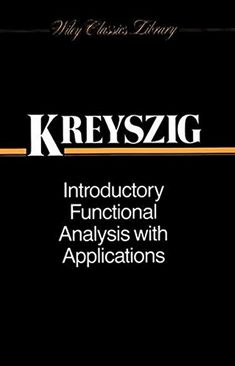
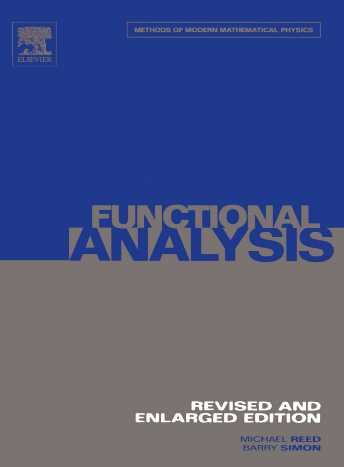

# Infinite dimensions

::: {.recommended-reading}

A very pedagogical text. Covers metric spaces, Banach spaces, Hilbert spaces, the fundamental theorems like the Hahn--Banach theorem, open mapping theorem, closed graph theorem. Spectral theory of self-adjoint operators, applications to quantum mechanics. (This makes the book special, together with its pedagogical level.)

{.recommended-reading-cover fig-alt="Book or resource cover"}

:::

::: {.recommended-reading}

A classic in PDE theory. Used in many graduate courses all over the world.

{.recommended-reading-cover fig-alt="Book or resource cover"}

:::

::: {.recommended-reading}

A classic. Maybe not the most accessible text, but it is very much geared towards mathematical physics.

{.recommended-reading-cover fig-alt="Book or resource cover"}

:::

::: {.recommended-reading}

Eberhard Zeidler was a giant of nonlinear functional analysis, and enormously productive. Many of his volumes focus greatly on pedagogical exposition and motivation for study. This book is no exception.

{.recommended-reading-cover fig-alt="Book or resource cover"}

:::

We now enter the realm of inifinite dimensional vector spaces. The mathematical field that studies such objects is called *Functional Analysis*. Infinite dimensional vector spaces are often spaces of *functions*. We know that operators like the derivative acts linearly on differentiable functions. Hence, *functional analysis is the mathematical language of analysis of partial differential equations*.

In quantum chemistry, our laws of nature are *linear*, e.g., the time-independent Schrödinger equation is a *linear partial differential equation*. On the other hand, many of our approximation methods are *nonlinear* in nature. Such methods comprise self-consistent field methods like Hartree--Fock and density-functional theory, complete-active space self-consistent field theory, and coupled-cluster theory. Hartrr--Fock, for example, can be viewed as a coupled set of nonlinear integro-partial differential equations. The mathematical analysis of these methods then needs *nonlinear functional analysis*. Since most methods are formulated in terms of optimization of some energy function, we must deal with *nonlinear optimization* in infinite dimensions. There are also methods, like many-body perturbation theory, that are not variational, but instead needs the abstract theory of *perturbation theory* in order to be studied.

All these topics are fairly advanced, and usually encountered only after a few semesters' mathematics studies. The published mathematics papers that study quantum chemical methods mathematically are brilliant and truly inspiring works of famous mathematicians such as P.-L. Lions, E.H. Lieb, B. Simon, and T. Kato, to name a few. Hence, this section will only mention some concepts and try to draw some lines, to get a feel for the concepts that the mathematician works with. Maybe it can be a help to read and understand mathematics papers on quantum chemistry methods, and to bridge a language barrier that certainly is present.

## Introducing infinite dimensions

We have previously studied finite-dimensional vector spaces. However, quantum mechanics is formulated with an infinite dimensional vector space -- a separable Hilbert space. The quantum chemist may say, "but we always introduce a basis set, and then we are in finite dimensions!" True, but the underlying physical model can *not* be formulated in finite dimensions. For example, if we consider quantum mechanics in one spatial dimension, the canonical commutator relation $$[\hat{x}, \hat{p}_x] = \mathrm{i}\hbar \mathbf{1}$$ requires infinite dimensions. Furthermore, in order to prove error estimates of some quantum chemical model, one needs to in some way compare the finite dimensional model with the infinite dimensional "exact" model. This is best done by basically working in the infinite dimensional setting all the time, considering instead finite dimensional subspaces of the function spaces involved. *Quantum chemists are used to talking about the full-configuration interaction limit as "exact". It is not! One still has the basis set error. This can not be eliminated in finite dimensions.*

In @def-vector-space, @sec-general-finite-dimensional, we introduced a general vector space. There is no reason why a general vector space should have a finite dimension. Here are some examples of vector spaces that have infinite dimension:

::: {#exm-space-of-all-functions-over-a-set}

## Space of all functions over a set

Let $S$ be a set. The space of all functions $f : S \to \mathbb{F}$ is a vector space, with addition and scalar multiplication defined pointwise, $$[f + g](x) = f(x) + g(x), \quad [\alpha f](x) = \alpha f(x).$$ The dimension of this space is at least as large as the cardinality of $S$. To see this, let $y \in S$ be arbitrary, and let $f_y : S \to \mathbb{F}$ be the function defined by $f_y(x) = 0$ if $x\neq y$ and $f_y(y)=1$. These functions are linearly independent. Thus every point in $S$ gives a linearly independent vector.

Special cases: $S = \mathbb{N}$ gives the set of all sequences. $S = \{1,2,\cdots,N\}$ gives $\mathbb{F}^n$ (without the inner product, which is extra information).

:::

::: {#exm-space-of-all-polynomials}

## Space of all polynomials

The space of all polynomials $p : \mathbb{F}\to\mathbb{F}$ with coefficients in $\mathbb{F}$ is a vector space. If we set $S = \mathbb{F}$ in the previous example, the space of all polynomials is a subspace of the space of all functions from $\mathbb{F}$ to $\mathbb{F}$. An arbitrary element of our vector space can be written as $$p(x) = a_0 + a_1 x + a_2 x^2 + \cdots a_n x^n$$ for a vector $\mathbf{a} = [a_0, \cdots, a_n] \in \mathbb{F}^{n+1}$. Note that $n$ depends on $p$, and is not bounded, so the dimension is infinite. In particular the monomials $x^n$ are linearly independent, and there are infinitely many of these.

:::

::: {#exm-space-of-continuous-functions}

## Space of continuous functions

Let $\Omega \subset \mathbb{R}^n$ be a bounded, closed domain, such as a box $[0,1]^n$ which includes its boundary. Consider the set $C^k(\Omega)$ of functions that are continuous at all points in $\Omega$, with continuous partial derivatives of order $\leq k$. (See @sec-differentiability.) Consider in particular the special case $k=0$. We can supply a norm on this space, $$\|f\|_\infty = \max \left\{ |f(x)| \mid x \in \Omega \right\}.$$ The maximum can be shown to be attained, since $\Omega$ is bounded and closed, and hence compact. (We have not covered compactness so far in the lecture notes.) It is a fact that $C^0$ is complete with this norm. This means. that if $f_k \in C^0(\Omega)$ is a sequence of continuous functions, and if $$\|f_j - f_k\|_\infty =\max\{ |f_j(x)-f_k(x)| \mid x \in \Omega \}$$ is a Cauchy sequence, then it converges to some $f\in C^0(\Omega)$, a continuous function. The completeness can be generalized to $C^k$, but we have to modify the norm accordingly.

:::

<!-- Legacy TODO: Add plots illustrating the norm and convergence. -->

::: {#exm-n-electron-hilbert-space}

## $N$-electron Hilbert space

This is the main vector space of quantum chemistry, and a central ingredient in the mathematical formulation of molecular problems in the Born--Oppenheimer approximation. This space is constructed as follows: Let $X = \mathbb{R}^3 \times \{\uparrow, \downarrow\}$ be two copies of Euclidean space. Here, $\uparrow$ and $\downarrow$ are simply symbols that we associate with spin up and down ("$\alpha$" and "$\beta$" spin). The set $X$ is made into a measure space by assigning the product of Lebesgue measure and counting measure (see [measure and integration theory](../parts/measure-and-integration.qmd)). We now can define *single-electron space* $\mathcal{H}_1 = L^2(X;\mathbb{C})$. For multiple electrons, we take *the antisymmetric tensor product $N$ times*, $$\mathcal{H}_N = \mathcal{H}_1 \wedge \mathcal{H}_1 \cdots \wedge \mathcal{H}_1 \quad \text{($N$ times)}.$$ The elements of $\mathcal{H}_N$ now become antisymmetric upon permutation of the particle indices, i.e., for all pairs $(i,j)$, $$\psi(x_1,\cdots, x_j, \cdots, x_i, \cdot ,x_N) = - \psi(x_1, \cdots, x_i, \cdots, x_j, \cdots, x_N).$$

By theorems on spaces of square integrable functions, we have the alternative characterization: $\psi \in \mathcal{H}_N$ if and only of $\psi \in L^2(X^N)$ and is antisymmetric. Since $X^N$ can be viewed as $2^N$ copies of $\mathbb{R}^{3N}$ associated with the $2^N$ unique arrangements of $N$ spins, we also have $\psi \in L^2(\mathbb{R}^{3N})^N$, i.e., $\psi$ is a *vector of functions*. These functions are *not necessarily* antisymmetric, since they isolate the spatial coordinate.

:::

The infinite dimensional spaces we meet in functional analysis are often *spaces of functions*. These spaces, when supplied with a suitable topological structure, are designed to deal with partial differential equations. Here is an example that shows how this is done for a simple PDE:

::: {#exm-poisson-equation}

## Poisson equation

(For this example, we use nomenclature from [calculus and complex analysis](../parts/calculus-and-complex-analysis.qmd).) Let $\Omega = ]0,1[^3 \subset\mathbb{R}^3$ be an open box, a typical domain with a well-behaved boundary $\partial\Omega$. Consider the Poissin equation, a PDE, formulated "classically": Find $u : \Omega \to \mathbb{R}$ such that $$\begin{aligned}
 \nabla^2 u(\mathbf{x}) &= f(\mathbf{x}), 
  \quad \mathbf{x} \in \Omega \\
 u(\mathbf{x}) &= 0, \quad \mathbf{x}\in\partial\Omega
\end{aligned}$$ where $f : \mathbb{R}^3\to \mathbb{R}$ is some function, and such that $u(\mathbf{x}) = 0$ on $\partial\Omega$. What is meant by a solution to this equation? Should we require $u$ to have continuous derivatives up to and including second order? Is it enough that the second order derivatives exist? What are the properties of the "data" $f$? These questions must be answered, such that one can provide a sound theory for existence and uniqueness of solutions.

If we introduce the Sobolev space $H^1_0(\Omega)$ of twice weakly differentiable functions over $\Omega$ that vanishes on the boundary, this is a Hilbert space. In fact the Laplace operator $\nabla^2$ is a continuous operator from $H^1_0(\Omega)$ into the space $H^{-1}_0(\Omega)$, which is a set that also contains some generalized functions, i.e., functions that are not really functions, but make sense when we integrate them. It is big! Then, the PDE can be formulated as: Given $f \in H^{-1}_0(\Omega)$, find $u \in H^1_0(\Omega)$ such that $$\hat{A} u = f.$$ Now, one can show that $\nabla^2 = \hat{A} : H^1_0\to H^{-1}_0$ is in fact not only continuous, but also invertible, with a continuous inverse. Then, there exists a unique solution $u = \hat{A}^{-1} f$ that depends *continuously* on $f$.

Now, one can introduce the *Galerkin method*: Choose a finite dimensional subspace $V \subset H^1_0(\Omega)$ with basis $\{b_i\}$. For example, a finite element space. This space is suitable for approximation, in the sense that we can refine the finite element mesh and obtain approximations of any accuracy of elements in $H^1_0$. The PDE becomes a linear algebra problem, $$A \mathbf{u} = \mathbf{f},$$ with $A_{ij} = \left\langle b_i,\hat{A} b_j\right\rangle = \left\langle\nabla b_i,\nabla b_j\right\rangle_{L^2}$ and $f_j = \left\langle b_k, f\right\rangle_{L^2}$.

From the structure of the function spaces and the Galerkin space, we know that this approximation is convergent as the mesh becomes finer. We even have error estimates.

This methodology is quite powerful, and amply motivates the study of functional analysis for studying PDEs.

:::

<!-- Legacy TODO: Elevate this example to a section. -->

## Banach spaces and Hilbert spaces

In @sec-topological-vector-spaces, we introduced the inner product spaces and normed spaces. However, the spaces that are most useful in analysis are *complete spaces*: Accroding to @def-cauchy-complete a space is complete if all sequences that "ought to converge" actually converges. All possible limits of sequences are present, and there are no holes, so to speak, in the space.

::: {#def-banach-hilbert}

## Banach and Hilbert space

A *Banach space* is a complete normed vector space. A *Hilbert space* is a complete inner product space.

:::

All Hilbert spaces are Banach spaces, but not vice versa.

Infinite dimensional spaces can be *huge*. Usually, we will be mostly interested in separable spaces:

::: {#def-separable}

## Separable space

A Banach space $X$ is called *separable* if it contains a dense countable subset, i.e., a countable $A \subset X$ such that the closure of $A$ is $X$.

:::

Recall that a subset $A\subset V$ is dense if its closure is $V$. For example, the rationals $\mathbb{Q}$ are dense in $\mathbb{R}$. A space is separable if there exists some *list of elements* that form a dense subset: all elements of the space can be written as limits of sequences of elements taken from this list. This seems rather drastic, but thankfully, most spaces of interest to us are separable.
