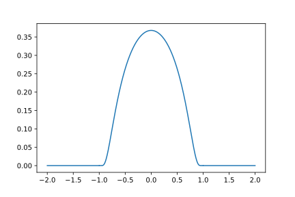

# $L^p$ spaces (Lebesgue spaces)

Consider some open subset $\Omega \subset \mathbb{R}^n$, with a "nice" boundary (e.g., piecewise smooth) and consider the set of measurable functions $f : \Omega \to \mathbb{F}$. (See [measure and integration theory](../parts/measure-and-integration.qmd) on measure and integration theory. Measurable functions are roughly those that have an integral, even if it may be infinite.) We have previously encountered the $L^p$-spaces.

Recall the fact that $[f]\in L^p(\Omega)$ is an equivalence class of almost-everywhere equal functions. We now have the strange situation that *this is almost universally ignored*; one writes things like "Let $f$ be defined as *some definition* be a function, and we now show that $f \in L^p$". Only when there is doubt about some property, e.g., a singularity, one suddenly reintroduce the notion of equivalence class. Talk about abuse of notation! So this is something to be aware of.

We also have the case $p = +\infty$, but then the norm is not defined as an integral, but rather the *essential supremum*: $$\|f \|_\infty := \operatornamewithlimits{ess sup}_{x\in\Omega} |f(x)|,$$ where the *essential supremum* means $$\operatornamewithlimits{ess sup}_{x\in\Omega} |f(x)| := \inf \{ \sup_{x \in \Omega\setminus Z} |f(x)| \mid Z \text{ has zero measure} \}.$$ This is a bit of a mouthful, but it essentially means "maximum, but try to take away point sets of zero measure to lower the value". The space $L^\infty$ is not separable.

::: {#def-ae}

## Almost everywhere

Let $f$ be a measurable function over a measure space. Let $P(f(x))$ be a statement, such as "$|f(x)|<1$. We say that $P(f(x))$ holds *almost everywhere* if it holds everywhere except for a set of measure zero.

:::

::: {#exm-coulomb-potential}

## Coulomb potential

In the analysis of the molecular Schrödinger equation, we must deal with the singular Coulomb potential between charged particles. For the hydrogen atom in the Born--Oppenheimer approximation, $$V(\mathbf{r}) = \frac{1}{r} = \frac{1}{\|\mathbf{r}\|} = \frac{1}{\sqrt{x^2 + y^2 + z^2}}.$$ As a function $1/r$ does not live in any of the $L^p$ spaces due to the singularity at the origin. On the other hand, the physics of the Coulomb potential has a short-range and a long-range part. The short-range part is responsible for the *nuclear cusp* in the wavefunction, while the long-range part is responsible for the infinite scattering cross section. Thus, we split $V$ into a long-range and a short-range part, by introducing some ball $\Omega = B_R(\mathbb{R}^3)$ and setting $$V = V_\text{sr} + V_\text{lr} = \frac{1}{r} \chi_\Omega + \frac{1}{r}\chi_{\Omega^\complement}.$$ Now the long range part is clearly bounded by $1/R$, $$V_\text{lr} \in L^\infty(\mathbb{R}^3),$$ while the short-range part can be shown to be $$V_\text{sr} \in L^p(\mathbb{R}^3), \quad p \in [1,2].$$ For analysis, the value $p=3/2$ is often taken, giving $$V \in L^{3/2}(\mathbb{R}^3) + L^\infty(\mathbb{R}^3),$$ where the right-hand side is defined as the space of functions splittable as a sum with terms from each space. (This is in fact a Banach space when the proper norm is supplied.)

Thus, we see how Banach spaces can be used to handle some singular potentials. This can in turn help with formulating the Schrödinger equation in a rigorous manner.

:::

## The weak derivative

Studying PDE, one needs partial derivatives of functions in $L^p$-spaces. However, we have seen that such functions are only defined up to a set of measure zero. In order to define partial derivatives of $L^p$ functions, we need a strategy that deals with this. The solution is the *weak derivative*.

We first need the notion of a test function.

::: {#def-test-functions}

## Test functions

Let $\Omega\subset\mathbb{R}^n$ be open. A *test function* is an infinitely differentiable function $f : \Omega \to \mathbb{F}$ with compact support, i.e., there is some closed and bounded set $K \subset \Omega$ such that $f$ is identically zero on $K^\complement$.

The set of test functions is denoted $C^\infty_0(\Omega)$.

:::

Test functions exist. The classic example is the following:

::: {#exm-bump}

## The bump function

Let $u : \mathbb{R}^n \to \mathbb{R}$ be given by $$u(\mathbf{x}) = \begin{cases} 0 & \|\mathbf{x}\| \geq 1 \\
        \exp(-1/(1 - \|\mathbf{x}\|^2)) & \|\mathbf{x}\| < 1
        \end{cases}$$ Then $u$ is infinitely many times differentiable, in particular across the boundary of the unit sphere, too. See @fig-bump.

:::

{#fig-bump}

From the above example, a huge number of test functions can be generated by *convolution*: Let $\eta = u/\int u$, normalizing the bump. Take any integrable function $f : \mathbb{R}^n\to\mathbb{C}$, and take the convolution with $\eta$, $$f_\epsilon(\mathbf{x}) = \int_{B_1(0)} \epsilon^{-n} \eta(\mathbf{y}/\epsilon) f(\mathbf{x}-\mathbf{y}) \, \mathrm{d}\mathbf{y}.$$ This process smooths $f$, and is called *mollification of $f$*. For small $\epsilon$, the function is only "slightly" modified, since the bump becomes very concentrated. In particular, if $f$ is supported in $K$, then $f_\epsilon$ is supported in only a slightly larger $K_\epsilon$.

In fact the set of test functions is *dense* in all the $L^p$ spaces except $L^\infty$. *Check precise wording of this.* All $L^p$ functions can be arbitrarily well approximated by such functions. Can you guess a construction of the approximate sequence for a given $f \in L^p(\Omega)$?

<!-- Legacy TODO: Produce a visualization. -->

Having established the set of test functions, we can now define the weak derivative:

::: {#def-weak-derivative}

## Weak derivative/distributional derivative

Let $f \in L^1_\text{loc}(\Omega)$ be a *locally integrable function*. This means that $f \in L^1_\text{loc}(K)$ for all bounded subsets $K \subset \Omega$. (This function set is very general, and contains all the $L^p$ spaces!)

A measurable function $g_k$ is called *a weak derivative* of $f$ if, for all test functions $\varphi\in C^\infty_0(\Omega)$, $$\int \varphi(\mathbf{x}) g_k(\mathbf{x}) \; \mathrm{d}\mathbf{c} = - \int \frac{\partial \varphi(\mathbf{x})}{\partial x_k} f(\mathbf{x}) \; \mathrm{d}\mathbf{x}.$$ We see that the weak derivative behaves just like the derivative of $f$ when being under the integral sign and "tested against" a test function.

Weak derivatives of higher order are defined completely analogously. Let $\alpha = (\alpha_1,\cdots,\alpha_k)$ denote a multi-index of nonnegative integers, and define $$\partial^\alpha = \frac{\partial ^{\alpha_1}}{\partial x_1^{\alpha_1}}\frac{\partial ^{\alpha_2}}{\partial x_2^{\alpha_2}}\cdots\frac{\partial ^{\alpha_n}}{\partial \alpha_n^{\alpha_n}}, \quad |\alpha| = \sum_{i=1}^n \alpha_i$$ $g_\alpha \in L^1_\text{loc}$ is a weak partial derivative of mixed order $\alpha$ if $$\int \varphi(\mathbf{x}) g_\alpha(\mathbf{x}) \; \mathrm{d}\mathbf{x} = (-1)^{|\alpha|} \int \partial^\alpha{\varphi(\mathbf{x})} f(\mathbf{x}) \; \mathrm{d}\mathbf{x}.$$ Mixed weak derivatives are symmetric. The weak derivative is unique up to a set of measure zero.

:::

## Sobolev spaces

A very important class of function spaces are Sobolev spaces.

::: {#def-sobolev}

## Sobolev space

Let $\Omega \subset \mathbb{R}^n$ be open. Let $p \in [1,+\infty]$ (including infinite). Let $u \in L^p(\Omega)$, and suppose $u$ has weak derivatives up to order $k \geq 1$ that are *also* in $L^p(\Omega)$. Then we say that $u \in W^{k,p}(\Omega)$, a Sobolev space. The Sobolev space $W^{k,p}(\Omega)$ is a Banach space with norm $$\|u\|_{W^{k,p}} = \|u\|_p + \sum_{\alpha, |\alpha|\leq k} \|\partial_\alpha u\|_p,$$ where $\alpha$ denotes a partial derivative of order $\leq k$. *For example, order 1 means $\alpha\in\{1,\cdots,n\}$, order 2 means $\alpha = (\alpha_1,\alpha_2)$ with $\alpha_i \in \{1,\cdots,n\}$, and so on.*

:::

For encoding *boundary conditions*, it is useful to consider Sobolev spaces of functions that in some "integrable sense" vanish on $\partial \Omega$.

::: {#def-sobolev-space-homogenous-boundary-conditions}

## Sobolev space, homogenous boundary conditions

Let $\Omega\subset \mathbb{R}^n$ with piecewise smooth boundary. The space $W^{k,p}_0(\Omega)$ is defined as the clousure in the $W^{k,p}(\Omega)$ norm of the set of test functions $C^\infty_0(\Omega)$.

:::

The definition may seem arbitrary, but the denseness of the test functions in $W^{k,p}(\mathbb{R}^n)$ implies that this makes sense, and indeed corresponds to functions that vanish near the boundary, when $k>0$. When $k=0$ we just get $L^p(\Omega)$.
