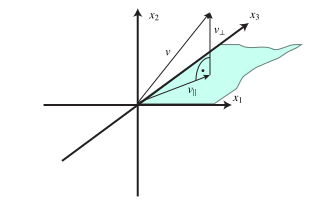

# Operators over separable Hilbert spaces {#sec-operators-over-hilbert-space}

Separable Hilbert spaces are central to quantum chemistry: The space of $N$-electron wavefunctions, and the subspace of those wavefunctions that have finite kinetic energy are examples. Let us therefore briefly mention some types of operators that can be encountered.

## Bounded operators

::: {#def-hermitian-adjoint-3}

## Adjoint operator

Let $(V,\left\langle\cdot,\cdot\right\rangle_V)$, $(W,\left\langle\cdot,\cdot\right\rangle_W)$ be separable Hilbert spaces over $\mathbb{F}$, and let $T \in L(V,W)$.

The *Hermitian adjoint* $T^\dag \in V(W,V)$ is the unique operator that satisfies $$\left\langle w,Tv\right\rangle_W = \left\langle T^\dag w,v\right\rangle_V$$ for all $v\in V$, $w \in W$.

If $H \in L(V,V)$, then $H^\dag \in L(V,V)$ is an operator over $V$. We say that $H$ is *Hermitian, or self-adjoint* if $H^\dag = H$.

:::

The Hermitian adjoint generalizes the corresponding concept for finite dimensional Hilbert spaces. The Hermitian adjoint may also be defined for unbounded operators, but self-adjointness becomes a more strict concept.

## Projectors

::: {#def-projector}

## Orthogonal projector

Let $V$ be a separable Hilbert space over $\mathbb{F}$. A *orthogonal projector* is a Hermitian (self-adjoint) $P \in B(V)$ that satisfies $P^2 = P$.

:::

The set $U = P[V]$ is a closed subspace of $V$, and any $v \in V$ can be uniquely decomposed as $$v = v_{\parallel} + v_{\bot},$$ where $v_\parallel = Pv \in U$ and $\left\langle v_\parallel,v_\bot\right\rangle = 0$. We have $v_\bot = v - v_\parallel$, and Pythagoras' Theorem $$\|v\|^2 = \|v_\parallel\|^2 + \|v_\bot\|^2.$$ A projection onto the $x_1x_2$-plane in $\mathbb{R}^3$ is illustrated in @fig-projection.

{#fig-projection}

## Spectral theorem

Self-adjointness (equal to Hermiticity for bounded operators) allow the important Spectral Theorem, which for *bounded* operators goes as follows:

::: {#thm-spectral-theorem-bounded}

## Spectral theorem for bounded self-adjoint operators

Let $V$ be a complex separable Hilbert space, and let $T \in L(V)$ be self-adjoint. The spectrum is real, $\sigma(T) \subset \mathbb{R}$, and compact. We have $$\|T\|_{L(V)} = \sup\{ |\lambda| \mid \lambda \in  \sigma(T) | \}.$$ Moreover, $T$ can be decomposed using what is called a *spectral measure* $E$ on the real line $\mathbb{R}$, defined on the Borel subsets of $\mathbb{R}$, such that

$$
T = \int_{\mathbb{R}} \lambda dE(\lambda).
$$ {#eq-spectral-decomposition}

 This integral represents $T$ in terms of a integral over the spectrum of $T$, where $\lambda$ represents the possible spectral values (e.g., eigenvalues), and $E(\lambda)$ acts as a projection operator that captures how much of Hilbert space corresponds to each value $\lambda$. (For each Borel subset of $\mathbb{R}$, such as an interval $I$, the integral $\int_I dE(\lambda)$ is a projection operator that projects onto the eigenspaces, ina generalized sense.)

:::

The spectral decomposition @eq-spectral-decomposition is immensely useful. It can be used to apply functions to the operator to build new operators with well-defined properties, similarly to what one can do in finite dimensions:

::: {#thm-spectral-calculus}

## Spectral calculus

Let $V$ be a complex separable Hilbert spae, and let $T \in L(V)$ be self-adjoint with spectral decomposition given by @eq-spectral-decomposition. Let $f : \mathbb{R}\to \mathbb{C}$ be any Borel measurable function. We can define a new operator $f(T)$ by the formula $$f(T) = \int_\mathbb{R}f(\lambda) dE(\lambda).$$

:::

::: {#exm-tdse}

## Solving the time-dependent Schrödinger equation

Suppose $V$ is the complex separable Hilbert space of quantum states of a nonrelativistic quantum system, and suppose $H \in L(V)$ is the governing Hamiltonian operator, i.e., the time-dependent Schrödinger equation reads $$i\hbar \frac{d}{dt} \psi(t) = H\psi(t), \quad \psi(0) = \psi_0.$$ This is an initial value problem and an ordinary differential equation in Hilbert space. (When $H$ is written out it often becomes a partial differential equation formulated in Sobolev spaces.) We have not really defined what we mean by this equation in the infinite dimensional case. However, the spectral theorem allows us to write $$H = \int_{\mathbb{R}} \lambda dE(\lambda),$$ and we can define a unitary operator by the formula $$U(t) = \exp(-iH t/\hbar).$$ This operator is well-defined. Assuming that formal differentiation with respect to time works out as in finite dimensional spaces, we see that $$\psi(t) = U(t)\psi_0$$ solves the time-dependent Schrödinger equation.

:::

For unbounded operators over a separable Hilbert space, self-adjointness is *not the same* as Hermiticity. The spectral theorem and spectral calculus can be extended to unbounded operators, but is more technical.

## Unitary operators

::: {#def-unitary-operator}

## Unitary operator

Let $V$ be a separable Hilbert space over $\mathbb{F}$, and let $U \in L(V)$. We say that $U$ is *unitary* if, for every $u,v\in V$, $$\left\langle Tu,Tv\right\rangle = \left\langle u,v\right\rangle.$$

:::

An example of a unitary operator is given in @exm-tdse.

## Hilbert Sobolev spaces

The Sobolev spaces $W^{k,2}(\Omega)$:

::: {#def-sobolev-hilbert}

## The spaces $H^k(\Omega)$ and $H^k_0(\Omega)$

The Sobolev spaces $W^{k,2}(\Omega)$ are denoted $H^k(\Omega)$. Similarly, $W^{k,2}_0(\Omega) = H^k_0(\Omega)$. They are Hilbert spaces with inner product: $$\left\langle u,v\right\rangle_{H^k} = \left\langle u,v\right\rangle_{L^2} + \sum_{\alpha, |\alpha|\leq k} \left\langle\partial_\alpha u, \partial_\alpha v\right\rangle,$$ where the sum over $\alpha$ again is a sum over partial derivatives of order $\leq k$.

The special case $k=1$, $$\left\langle u,v\right\rangle_{H^1} = \left\langle u,v\right\rangle_{L^2} +  \left\langle\nabla u, \nabla v\right\rangle_{L^2}.$$

:::

::: {#rem-kinetic-energy-and-sobolev-spaces}

## Kinetic energy and Sobolev spaces

In quantum mechanics, the kinetic energy operator is $\hat{T} = -\frac{1}{2}\nabla^2$, an unbounded but Hermitian operator. When supplied with the domain $D(\hat{T}) = H^2_0$, then it is in fact self-adjoint.

Suppose $u \in H^1_0(\Omega)$. Then we see that $$\left\langle u,\hat{T} u\right\rangle = \frac{1}{2} \left\langle\nabla u, \nabla u\right\rangle < +\infty.$$ Here, we assumed that integration by parts is allowed with the weak derivative. Indeed it is in $H^1_0(\Omega)$! Thus, $H^1_0(\Omega)$ is precisely the set of normalizable wavefuctions that has finite kinetic energy and vanish at $\partial \Omega$. This is one of the main steps of the "weak formulation" of the Schrödinger equation.

:::
