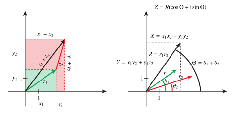

# Numbers

## The integers, the rationals, and the reals

The natural numbers are the counting numbers, $$\mathbb{N} = \{ 0, 1, 2, \dots \}.$$ It is a set of cardinality $\aleph_0$, the "smallest" infinity. The integers are the numbers ("Zahlen") $$\mathbb{Z} = \{ \dots, -3, -2, -1, 0, 1, 2, \dots \},$$ which has the *same* cardinality as $\mathbb{N}$. Next, the rational numbers ("quotients"), $$\mathbb{Q} = \left\{ \frac{p}{q} \mid p,q \in \mathbb{Z}, \, q \neq 0 \right\}.$$ The cardinality is again $\aleph_0$.

*Exercise: prove that these sets have the same cardinality, and that the reals have a greater cardinality.*

Next up is the set of real numbers, but the precise definition of these in terms of $\mathbb{Q}$ is subtle. Let us therefore be very imprecise, and denote the reals by the set of all infinite decimal expansions, $$\begin{aligned}
    \mathbb{R} &= \{ \, \text{infinite decimal expansions of numbers} \, \} \\
    &=
    \mathbb{R} = \left\{ (-1)^s 10^{p} \times 0.a_1 a_2 a_3 a_4 \cdots \mid s \in \{0, 1\}, \, p \in \mathbb{Z}, \, \forall j\in\mathbb{N}, \, a_j \in \mathbb{Z}_{10} \right\},
\end{aligned}$$ where $\mathbb{Z}_{10} = \{0, 1, 2, 3, 4, 5, 6, 7, 8, 9 \}$. The symbol "$\forall$" means "for all". Strictly speaking, this definition of $\mathbb{R}$ does not make sense, since we have to define what an infinite decimal expansion means. The correct answer is that it is a *limit* of rational number approximations, or rather an *equivalence class* of such.

We will not dig deeper into the real numbers. It is common to simply view the reals in an informal manner as a continuous infinite line, with the integers and rationals marked off, and the "gaps" denoting *irrational numbers* being those numbers that need infinitely many decimal places in any base, i.e., those reals which are not in $\mathbb{Q}$.

The real numbers have a special property: They are *complete* in the Cauchy sense. Informally, all sequences that "ought to converge" actually converges. We will talk more about this later.

The basic properties of the real numbers are usually formalized as a theorem:

::: {#thm-statement}

## Statement

There is a unique number system called the real number system which is a complete ordered field.

:::

By "ordered" we mean that it is always true that $a \leq b$ or $b \leq a$ for any $a,b \in \mathbb{R}$. By "unique" we mean that all other constructions that satisfy the axioms of fields, and is ordered, can be put into a one-to-one correspondence, this correspondence being compatible with the rules of multiplication, addition, and the ordering. In fact, this theorem justifies the mental picture of the reals as, indeed, the "real line".

These number sets are fairly easy to get a grasp on, and we note that they are included in one another, written $$\mathbb{N} \subset \mathbb{Z} \subset \mathbb{Q} \subset \mathbb{R}.$$ The sets $\mathbb{Q}$ and $\mathbb{R}$ are also *fields*. Fields are abstractions of, well, numbers, with the following axioms:

::: {#def-field}

## Field

Let $\mathbb{F}$ be a set, together with binary operations $+$ (addition) and $\cdot$ (multiplication) such that the following holds:

1.  Commutativity of addition: $x + y = y + x$

2.  Associativity of addition: $x + (y + z) = (z + y) + z$

3.  Identity element for addition: There is a zero element $0 \in \mathbb{F}$ such that $0 + x = x$ for all $x \in \mathbb{F}$

4.  Inverses for addition: For every $x \in \mathbb{F}$ there is a $y \in \mathbb{F}$ such that $x + 
        y = 0$.

5.  Commutativity of multiplication: $x \cdot y = y \cdot x$

6.  Associativity of multiplication: $x \cdot (y \cdot z) = (z \cdot y) \cdot z$

7.  Identity element for multiplication: There is a unit element $1$ such that $1 \cdot x = x$

8.  Inverse for multiplication: For every $x \neq 0$ there is a $y$ such that $x\cdot y = 1$.

9.  Distributive law: $x\cdot (y + z) = x\cdot y + x \cdot z$.

:::

In short, numbers in a field can be manipulated using *all* the usual operations of real numbers. What distinguishes the rationals from the reals, is that the reals are complete.

## Complex numbers

Besides $\mathbb{R}$, the complex numbers $\mathbb{C}$ are extremely important for us. The complex numbers are defined in terms of the real numbers by adjoining to $\mathbb{R}$ a special element $\mathrm{i}$ that satisfies $$\mathrm{i}^2 = -1.$$ Adding this element alone does not generate a field, because a field must be closed under addition and multiplication. The smallest field that contains $\mathbb{R}$ and $\mathrm{i}$ is the set $$\mathbb{C} = \{ a + \mathrm{i}b \mid a, b \in \mathbb{R} \},$$ which is also a field, but no longer an ordered field!

Important unary operations: Let $z = a + \mathrm{i}b \in \mathbb{C}$. Real part, $\operatorname{Re}z = a$. Imaginary part, $\operatorname{Im}z = b$. Complex conjugate, $\bar{z} = z^* = a - \mathrm{i}b$. Modulus, $|z| = \sqrt{a^2 + b^2}$.

::: {#exm-multiplication-and-addition-of-complex-numbers}

## Multiplication and addition of complex numbers

Given two complex numbers $z_1 = x_1 + \mathrm{i}y_1$ and $z_2 = x_2 + \mathrm{i}y_2$. We compute the sum of the complex numbers: $$z_1 + z_2 = (x_1 + \mathrm{i}y_1) + (x_2 + \mathrm{i}y_2) = (x_1 + x_2) + \mathrm{i}(y_1 + y_2).$$ We compute the product: $$z_1 z_2 = (x_1 + \mathrm{i}y_1)(x_2 + \mathrm{i}y_2) = x_1 x_2 - y_1 y_2 + \mathrm{i}(y_1 x_2 + x_1 y_2),$$ where we used $\mathrm{i}^2 = -1$.

:::

## Geometric interpretation

A geometric interpretation of the complex numbers was first given by the Norwegian cartographer and mathematician Caspar Wessel, who used complex numbers in his cartography work. The interpretation is as follows: Draw a two-dimensional coordinate system. The horizontal axis is the real line, while the vertical axis is the purely imaginary numbers $\mathrm{i}\mathbb{R}$. A point in the plane with coordinates $(x,y)$ now corresponds to the complex number $z = x + \mathrm{i}y$. The rules of addition become the usual plane vector addition rules (componentwise addition/putting the tip of one arrow at the end of another arrow), while the rules of multiplication becomes multiplication of the moduli (lengths). and addition of the angles, between the points and the positive real line. See @fig-geometric-complex.

{#fig-geometric-complex}

## Fundamental theorem of algebra

The complex numbers set $\mathbb{C}$ a kind of Columbi egg to solve the problem that a polynomial of degree $n$ over the real numbers may not have a full set of $n$ roots.

::: {#thm-fundamental-theorem-of-algebra}

## Fundamental theorem of algebra

Every polynomial $p$ of degree $n$ over $\mathbb{C}$ have exactly $n$ roots in $\mathbb{C}$, i.e., there is a nonzero $C \in \mathbb{C}$ and $n$ numbers $r_i \in \mathbb{C}$, such that $$p(z) = C (z-r_1)(z-r_2)\cdots (z-r_n).$$

:::

Descartes used the term "imaginary" about the complex numbers. It was not because it was imaginative or similar, but rather in a pejorative sense: these numbers provide solutions to the root equations, but the roots are useless, since they don't exist anyway.

Well, do the complex numbers exist or not? Maybe he would have changed his mind if he saw the geometric interpretation -- who knows?
