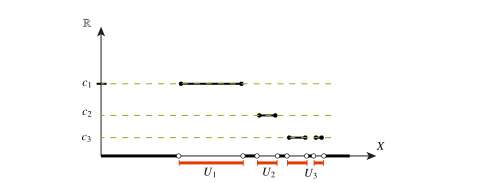
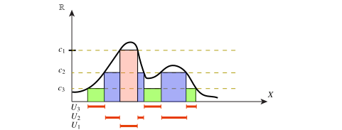

# The integral

We now turn to actually defining the integral of a measurable function. One begins by defining the integral of *simple functions*.

::: {#def-simple-functions}

## Simple functions

Let $(X,\boldsymbol{X})$ be a measurable space. Let $f : X \to \mathbb{R}$ be a measurable function. We say that $f$ is a *simple function* if it takes on only finitely many function values. The set of simple functions is denoted $\mathcal{S}$. The set of non-negative simple functions is denoted $\mathcal{S}^+$.

A simple measurable function has a *unique* decomposition as $$f = \sum_{i=1}^n c_i \chi_{U_i}, \quad U_i \in \boldsymbol{X}, \quad U_i \cap U_j = \emptyset.$$

:::

{#fig-simple-function}

A simple function is illustrated in @fig-simple-function. What should the integral of this simple function be? Clearly, the integral of the characteristic function $\chi_U$ of some measurable $U$ should be the volume, or measure, of $U$! We have to be careful, since the measure of $U$ can be infinite.

::: {#def-integral-of-non-negative-simple-function}

## Integral of non-negative simple function

Let $(X,\boldsymbol{X},\mu)$ be a measure space. Let $f : X \to \mathbb{R}$ be simple and non-negative. We *define* the integral of $f$ to be the *extended valued function* $I : \mathcal{S}^+ \to \mathbb{R}\cup\{+\infty\}$ given by, $$\int_X f \, \mathrm{d}\mu = I\left(\sum_i c_i \chi_{U_i}\right) = \sum_i c_i \, \mu(U_i).$$ The function $I$ is linear and *monotone*, $$f,g\in\mathcal{S}^+, \quad f \leq g \implies I(f) \leq I(g).$$

:::

Let now $f: X \to [0,+\infty[$ be a non-negative measurable function. It is implicit here, that we have the Borel $\sigma$-algebra on the real numbers. How do we define the integral? The idea is to *approximate* $f$ by simple functions from below, and indeed this can always be done.

::: {#def-integral-of-non-neagative-functions}

## Integral of non-neagative functions

Let $(X,\boldsymbol{X},\mu)$ be a measure space, and let $f : X \to [0,+\infty[$ be measurable. We define the integral of $f$ to be $$\int_X f \, \mathrm{d}\mu = \sup\left\{ I(h) \mid h \in \mathcal{S}^+ , \, h \leq f \right\} \in [0,\+\infty].$$ The function $f$ is *integrable* if $\int_X f \, \mathrm{d}\mu < +\infty$.

:::

Thus, we take every non-negative simple function that lies below $f$, compute the integral, and maximize over all such simple functions. If $f$ can be approximated by simple functions, which it can, then the integral could and should converge. (The technical result that allows approximation from below in this way is *the monotone convergence theorem*.)

In @fig-func-approx-simple, the approximation of $f$ by simple functions is illustrated. From this illustration we take home perhaps the most important intuition: Whereas the Riemann integral is defined in terms of approximating the are below the graph by vertical strips, the measure-theoretic integral instead consider horizontal strips!

{#fig-func-approx-simple}

In the next result, the phrase $\mu$-almost everywhere, abbreviated $\mu$-a.e., means that the condtion holds for every $x \in X$ *except possibly* at a set of measure zero.

::: {#thm-properties-of-the-integral}

## Properties of the integral

Let $(X,\boldsymbol{X},\mu)$ be a measure space, and let $f \geq 0$ be a measurable function $f : X \to \mathbb{R}$. The integral on such functions satisfies: Monotone: $$f \leq g \quad \text{measurable functions} \implies \int_X f\, \mathrm{d}\mu \leq \int_X f \, \mathrm{d}\mu$$ Vanishing on set of measure zero: $$f = 0 \quad \text{$\mu$-a.e.} \iff \int_X f\, \mathrm{d}\mu = 0.$$ Irrelevant on set of measure zero: $$f = g \quad \text{$\mu$-a.e.} \implies \int_X f \, \mathrm{d}\mu = \int_X \, \mathrm{d}\mu$$

:::

The concept of "almost everywhere" is very important when Lebesgue integrals are considered. Whenever a function is only "used" to define integrals, it does not matter what the function values are at a set of measure zero. As we have seen, such sets can be fairly large!

We can now define the integral of arbitrary measurable functions.

::: {#def-integral}

## Integral

Let $(X,\boldsymbol{X},\mu)$ be a measure space, and let $f : X \to \mathbb{R}$ be measurable. Let $f_+$ and $f_-$ be the positive, resp., negative part of $f$. We define $f$ to be integrable if $f_+$ and $f_-$ are ingegrable, and we define $$\int_X f \, \mathrm{d}\mu = \int_X f_+ \, \mathrm{d}\mu - \int_X f_-\,\mathrm{d}\mu.$$

:::

s
