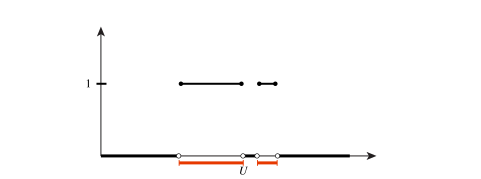

# Measure

We now add the next ingredient: a measure.

::: {#def-measure-measure-space}

## Measure, measure space

Let $(X,\mathcal{X})$ be a mesurable space. A *measure* is a function $\mu : \boldsymbol{X} \to [0,+\infty[ \cup \{+\infty\}$ that satisfies

1.  $\mu(\emptyset) = 0$

2.  For a countable family of disjoint subsets $\{A_i\}\subset \mathcal{X}$, i.e., $A_i\cap A_j = 0$, we have $$\mu\left(\bigcup_i^\infty A_i\right) = \sum_i^\infty \mu(A_i) \qquad\text{$\sigma$-additive}$$

We then say that $(X,\boldsymbol{X},\mu)$ is a measure space.

:::

The definition of the measure $\mu$ encapsulate some intuitive notions about measuring volumes. Volume of nothing is zero, and volume of unions of sets is the sum of the volume. Finally, the infinite union allows for *approximation* of volumes. Note that a similar idea was present in the definition of the $\sigma$-algebra.

An example that shows how measure can be used differently, consider counting measure:

::: {#exm-counting-measure}

## Counting measure

Let $N$ be a finite set, and let $\boldsymbol{N} = 2^N$, the set of all subsets of $N$. This is a $\sigma$-algebra, and since $N$ is finite, we can define counting measure: $$\mu(A) = |A| \quad \text{(number of elements)}$$ Having a measure theoretic concept of counting is more useful that one would think! For example, it will allow us to rigorously define square integrable functions over electron configuration space $\mathbb{R}^3 \times \{ \uparrow, \downarrow\}$ in a manner which does not artificially distinguish between discrete and continuous degrees of freedom.

:::

We next introduce the notion of a *measurable function*. These are functions that we later can define the integral for.

::: {#def-measurable-function}

## Measurable function

Let $(X,\boldsymbol{X})$ and $(Y,\boldsymbol{Y})$ be measurable spaces. A function $$f : X \to Y$$ is called *measurable* if, for all $U \in \boldsymbol{Y}$, $$f^{-1}[U] \left\{ x \in X \mid f(x) \in U \right\} \in \boldsymbol{X}$$

:::

Note the close analogy with the definition of continuous functions between metric (or more generally topological) spaces: The inverse image of an open set must be open. Measurability of a function is certainly less restrictive: The inverse image of an open set need only be measurable -- and we saw that there are "complicated" measurable sets.

Just like for continuous functions, when $f : X \to Y$ with $Y=\mathbb{F}^n$, we get that linear combinations of measurable functions are again measurable. We can also multiply or take absolute values of masurable functions, and still get measurable functions. *Perhaps formulate as theorem*

{#fig-char-fun}

::: {#exm-example-9}

## Example

Why is this a definition that can be useful? Consider the *characteristic function* $\chi_U$ of some subset $U \subset Y$, defined by $$\chi_U(y) = \begin{cases} 1 & y \in U \\ 0 & y \notin U \end{cases}$$ See @fig-char-fun. Then the inverse image $\chi_U^{-1}[1]$ is exactly $U$. If $U$ is actually measurable, this means that we can measure it with a measure $\mu : \boldsymbol{Y}\to [0,+\infty[$.

:::

::: {#exm-example-10}

## Example

Consider the function $$f(x) = \begin{cases} 1 & x \in \mathbb{Q}\\ 0 & x \in \mathbb{R}\setminus \mathbb{Q}\end{cases}$$ This function is not Riemann integrable, since the upper and lower Riemann sums will converge to different numbers. However, since $f = \chi_\mathbb{Q}$ we now expect it to be integrable. But what will be the integral? Since $\mu(\mathbb{Q})=0$ we expect that $f^{-1}(1)=\mathbb{Q}$ will not contribute, i.e., the integral is 0.

:::
