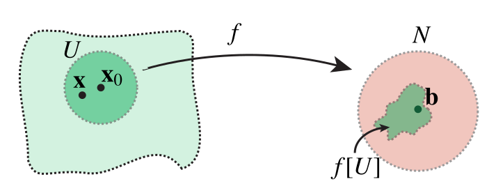
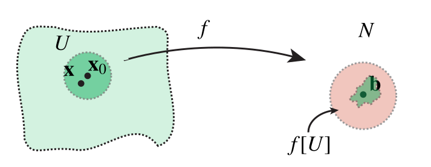
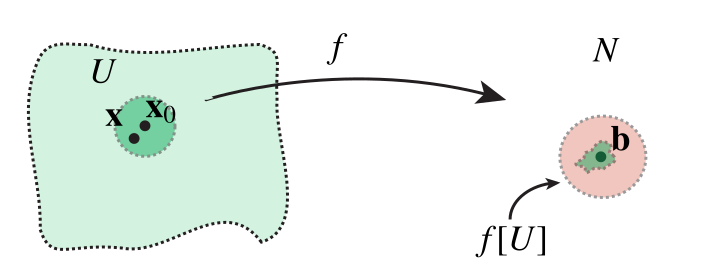

# Some topological concepts

The metric space topology allows us to formulate convergence of sequences in terms of open sets.

## Sequences and limits

::: {#def-sequence}

## Sequence

Let $S$ be a set. A *sequence* is a function $a : \mathbb{N} \to S$, i.e., an infinite "vector" $(x_1,x_2,x_3,\cdots)$, with $x_j = a(j) \in S$. It is common to suppress the actual function $a$ and simply write "$(x_j)$ is a sequence in $S$," or "let $(x_j) \subset S$ be a sequence," or other similar variants.

:::

Warning: Do not confuse the notation $x_j$ here with the $j$th component of a vector in $\mathbb{F}^n$! If we have a sequence in $\mathbb{F}^n$, we will have $n$ sequences of $\mathbb{F}$-numbers, $(\mathbf{x}_j)_{i} \in \mathbb{F}$.

Sometimes, the index is not a natural number, but some other countable set. This still defines a sequence, since countable sets can be be brought into 1-to-1 correspondence with the natural numbers. (Sometimes the index is even more general, such as a real mumber $\epsilon$ that goes to zero from above. In topology this is called a *net*. We will not discuss nets here.)

If $(M,d)$ is a metric space, we can study the convergence of the sequence.

::: {#def-convergent-sequence}

## Convergent sequence

Let $(M,d)$ be a metric space, and let $(x_i) \subset M$ be a sequence. If there is some $x \in M$ such that for all $\epsilon > 0$, there is an $N_\epsilon$ such that $i > N_\epsilon$ implies $d(x_i,x) < \epsilon$, we say that $(x_i)$ is convergent, and that it converges to $x$, written $x_i \to x\in M$, or $\lim_{i\to+\infty} x_i = x$.

:::

<!-- Legacy TODO: Elaborate with pictorial examples -->

Which sequences converge?

::: {#def-cauchy-sequence}

## Cauchy sequence

We say that $(x_i)$ is *Cauchy convergent* if for every $\epsilon > 0$ there is an $N_\epsilon \in \mathbb{N}$ such that $i,j > N_\epsilon$ implies $$d(x_i,x_j) < \epsilon.$$

:::

Thus, the elements of the sequence get closer and closer in a uniform manner. After the index $N_\epsilon$, no two elements *ever* get further apart than a distance $\epsilon$.

Such sequences *should* converge: It is inescapable that the distance between successive elements approach zero the further into the sequence one gets. In fact, the opposite assertion is true:

::: {#thm-statement-4}

## Statement

If a sequence converges, it is Cauchy convergent.

:::

Note that Cauchy convergence does not refer to the potential limit. Only elements at various positions in the sequence are referred to in the definition.

::: {#exm-non-convergent-cauchy-sequence}

## Non-convergent Cauchy sequence

Consider a sequence $(x_i) \in \mathbb{Q}$ of *rational numbers*. Let $x = \sqrt{2} \in \mathbb{R}\setminus \mathbb{Q}$ (an irrational number), and let $x_i$ be the decimal expansion of $x$ to $i$ significant digits after the decimal points. Thus, $x_1 = 1.4$, $x_2 = 1.41$, etc. If this sequence converges, it should be to $x$. It is straightforward to see that for $i>j$, $|x_i-x_j| = |(x-x_j) - (x - i_j)| \leq |x-x_j| + |x - x_i| \leq 10^{-i} + 10^{-j} \leq 2\cdot 10^{-j}$. So if we choose $\epsilon > 0$, find $j$ such that $2\cdot 10^{-j} < \epsilon$. We then see that $(x_i)$ is a Cauchy sequence. But the sequence does not converge to a rational number, beacuse we know the limit to be irrational.

:::

The example demonstrates that a space can be incomplete, in that it lacks certain limits.

::: {#def-cauchy-complete}

## Complete metric space

We say that $(M,d)$ is *(Cauchy) complete* if every Cauchy sequence is convergent.

:::

From the construction of the real numbers $\mathbb{R}$, Cauchy completeness is built in as a fundamental property. Using the Euclidean metric in $\mathbb{R}^n$, one can then show the very important fact that:

::: {#thm-statement-5}

## Statement

Euclidean space $\mathbb{F}^n$ is complete.

:::

Why is completeness important? The completeness of a metric space ensures that limits of Cauchy sequences exist within the space, providing a solid foundation for many important theorems and applications in analysis, physics, and applied mathematics, including quantum chemistry. Without completeness, the analysis would be prone to gaps and inconsistencies.

Open sets can be used to redefine convergence of sequences.

::: {#thm-convergence-in-terms-of-open-sets}

## Convergence in terms of open sets

Let $(x_i)\subset M$ be a sequence in a metric space $(M,d)$. Then $x_i$ converges to $x\in M$, if and only if for every open set $U$ containing $x$, $(x_i)$ is *eventually in $U$*, i.e., there is an $N_U\in \mathbb{N}$, such that $x_i \in U$ whenever $i>N_U$.

:::

The concept of Cauchy completeness can be reformulated using open and closed sets:

::: {#def-complete-metric-space}

## Complete metric space

A metric space $(M,d)$ is *complete* if for any open set $U \subset M$ (such as an $\epsilon$-ball $B_\epsilon(x) \subset M$), then $\operatorname{cl}(U) \subset M$.

:::

Intuitively, the boundary of every open ball should be contained in the set.

The following definition/theorem stresses the link between completeness and closed sets:

::: {#thm-limit-points-and-closure}

## Limit points and closure

Let $(M,d)$ be a metric space, and let $S \subset M$ be a subset. The closure $\operatorname{cl}(S)$ is the set of limit points of $S$: If $(x_i)\subset S$ is a sequence, and if $\lim x_i = x \in M$, then in actually $x \in \operatorname{cl}(S)$. Conversely, if $x \in \operatorname{cl}(S)$, there exists a sequence in $S$ that converges to $x$. The closure $\operatorname{cl}(S)$ is the *smallest* set that contains all the limit points of $S$.

:::

## Continuity

Take a function $f : [0,1] \to \mathbb{R}$, where $[0,1] = \{ x \in\mathbb{R} \mid 0 \leq x \leq 1\}$. You should be familiar, at least intuitively, with the notion of $f$ being continuous, perhaps differentiable (at a point or everywhere), or even smooth. These notions are defined using topology, since we somehow need to study the behavior of $f$ in the vicinity of some $x\in [0,1]$.

::: {#def-continuity}

## Continuity

Let $(M_1,d_1)$ and $(M_2,d_2)$ be complete metric spaces. Let a function $f : M_1 \to M_2$ be given, and let $x \in M_1$, $y = f(x) \in M_2$. We say that $f$ is *continuous* at $x$ if for every $\epsilon > 0$, there is a $\delta > 0$, such that $f[B_\delta(x)] \subset B_\epsilon(y)$. Equivalently, for every open set $V_2$ containing $y$, there is an open set $V_1$ containing $x$ such that $f[V_1]\subset V_2$.

:::

This may seem complicated, but using words, the definition simply says: $f$ is continuous at $x$ if points that are nearby $f(y)$ in the image come from points nearby $x$. For our function $f : [0,1] \to \mathbb{R}$, this states that you should be able to draw the graph without removing the pen from the paper.

(That picture is useful, but not entirely accurate -- when you move the pen, this must be in a smooth manner! But there are continuous functions that would require, say, infinite acceleration or an "infinite amount of ink.")

<!-- Legacy TODO: Make illustration of Weierstrass function -->

## Compactness

An important notion in metric spaces is that of *compactness*.

::: {#def-compact-sets}

## Compact sets

Let $(M,d)$ be a metric space, and let $S\subset M$. We say that $S$ is *compact* if every sequence $(x_i)\subset S$ has a convergent subsequence. That is, there is an increasing function $f:\mathbb{N}\to\mathbb{N}$ of indices such that $y_j := x_{f(i)}$ is a convergent sequence, $y_j \to y \in S$. Usually, subsequences are written informally as $y_j = x_{i_j}$.

:::

Compactness may be hard to get a grasp on from the get go, but the intuition is that $S$ behaves a little like a finite set. There is not too much "room" for the sequence $x_i$ to wander around. Eventually, it must revisit the same neighborhood (of $y$) infinitely many times, getting infinitely closer.

An important consequence of compactness is the following:

::: {#thm-images-of-compact-sets}

## Images of compact sets

If $f : M\to N$ is a function between metric spaces, and if $S \in M$ is a compact set, then $f[S] \subset N$ is compact.

:::

In finite dimensional vector spaces with a metric, compactness becomes easy to characterize:

::: {#thm-compact-sets-in-finite-dimensions}

## Compact sets in finite dimensions

If $(M,d)$ is a finite dimensional metric vector space, then every compact subset is closed and bounded. The converse is also true.

:::

## Continuity in finite dimensions

<!-- Legacy TODO: Move this section! -->

In @fig-continuity, the concept of a continuous function is illustrated, using a function $f : \mathbb{R}^2 \to \mathbb{R}^2$ as an example.

::: {#fig-continuity layout-ncol=3}

{width="50%"}

{width="50%"}

{width="50%"}

Illustration of the concept of continuity, using a function $f : \mathbb{R}^2 \to \mathbb{R}^2$ as an example. For every neighborhood $N$, taken to be an $\epsilon$-ball, there shoud be an open set $U$ such that $f[U] \subset N$. The ball $N$ becomes smaller and smaller, but we can always find a corresponding $U$. Then, $f$ is continuous.

:::

::: {#thm-statement-6}

## Statement

Let $f : \mathbb{F}^n \to \mathbb{F}^m$ be a function. Thus, we have $m$ functions $f_i : \mathbb{F}^n \to \mathbb{F}$, $f_i(\mathbf{x}) = f_i(x_1,\cdots,x_n)$. Then $f$ is continuous at $\mathbf{x}\in\mathbb{F}^n$ if and only if all the components $f_i$ are continuous in all the $n$ variable separately.

:::

## Limits and continuity

In Euclidean space, we are assigned a *topology* defined by the norm. That is, we can measure distances, $$d(\mathbf{x},\mathbf{y}) = \|\mathbf{x} - \mathbf{y}\|.$$

The metric (here, our norm) defines *$\epsilon$-balls*:

::: {#def-ball-2}

## $\epsilon$-ball

Ket $\mathbf{x}_0 \in \mathbb{R}^n$. The $\epsilon$-ball around $\mathbf{x}_0$ is the set $$B_\epsilon(\mathbf{x}_0) = \{ \mathbf{x}\in\mathbb{R}^n \mid \|\mathbf{x}-\mathbf{x}_0\| < \epsilon \}.$$

:::

The $\epsilon$-ball is the archetypal *open set*. Open sets are needed to understand the concepts of limits, continuity, and differentiation of functions.

::: {#def-open-and-closed-sets}

## Open and closed sets

A subset $A \subset \mathbb{R}^n$ is *open* if, for every $\mathbf{x}\in A$, there exists an $\epsilon$-ball completely contained in $A$.

The *complement* of $A$ is defined as $$A^\complement = \{ \mathbf{x} \in \mathbb{R}^n \mid \mathbf{x}\notin A \} = \mathbb{R}^n \setminus A.$$

We say that $A$ is *closed* if $A^\complement$ is open.

:::

*Illustration*

::: {#def-neghborhood}

## Neghborhood

Let $\mathbf{x}\in\mathbb{R}^n$. A *neighborhood* of $\mathbf{x}$ is any open subset that contains $\mathbf{x}$.

:::

::: {#def-boundary-and-interior-2}

## Boundary and interior

A point $\mathbf{x}\in A$ is called *a boundary point* if every neighborhood of $\mathbf{x}$ both contains a point in $A$ and a point in $A^\complement$.

The *boundary* $\partial A$ is the set of boundary points of $A$.

The *interior* of $A$ is the set of all points $\mathbf{x}\in A$ such that for some $\epsilon>0$, $B_\epsilon(\mathbf{x}) \subset A$.

The *closure* of $A$ is the smallest closed set containing $A$, and is equal to $A \cup \partial A$.

:::

*Illustration*

*Exercises*

::: {#def-limit}

## Limit

Let $f : \Omega \subset \mathbb{R}^n \to \mathbb{R}^m$, where $\Omega$ is open. Let $\mathbf{x}_0\in \Omega \cup \partial\Omega$, and let $N$ be a neighborhood of $\mathbf{b}\in \mathbb{R}^m$.

We say that $f$ is *eventually in $N$ as $\mathbf{x}$ approaches $\mathbf{x}_0$*, if there exists a neighborhood $U$ of $\mathbf{x}_0$, such that $\mathbf{x}
    \in U$ but $\mathbf{x}\neq\mathbf{x}_0$ and $\mathbf{x}\in \Omega$ imply $f(x)\in N$.

We say that *$f(\mathbf{x})$ approaches $\mathbf{b}$ as $\mathbf{x}$ approaches $\mathbf{x}_0$*, $$\lim_{\mathbf{x}\to\mathbf{x}_0} f(\mathbf{x}) = \mathbf{b} \quad\text{or}\quad f(\mathbf{x}) \to \mathbf{b} \; \text{as} \; \mathbf{x}\to\mathbf{x}_0,$$ when, given any neighborhood $N$ of $\mathbf{b}$, $f$ is eventually in $N$ as $\mathbf{x}$ approaches $\mathbf{x}_0$.

:::

Interpretation: $f(\mathbf{x})$ is close to $\mathbf{b}$ if $\mathbf{x}$ is close to $\mathbf{x}_0$.

Important to note that *limits are unique*.

::: {#def-continuity-2}

## Continuity

Let $f : \Omega \subset \mathbb{R}^n\to\mathbb{R}^m$. Let $\mathbf{x}_0\in\Omega$. We say that $f$ is *continuous at $\mathbf{x}_0$* if $$\lim_{\mathbf{x}\to\mathbf{x}_0} f(\mathbf{x}) = f(\mathbf{x}_0).$$

:::

This is the multidimensional version of the notion that the graph of a continuous function is unbroken, does not make jumps.

*Examples*

*Exercises*

::: {#thm-properties-of-continuous-functions}

## Properties of continuous functions

Let $f, g : \Omega\subset\mathbb{R}^n \to \mathbb{R}^m$ be functions with a common domain $\Omega$, continuous at $\mathbf{x}_0$: Then:

1.  $f+g$ and $\alpha f$ for any $\alpha\in\mathbb{R}$ are continuous at $\mathbf{x}_0$.

2.  In the scalar-valued case $m=1$, the product $fg$ is continuous at $\mathbf{x}_0$

3.  If $f \neq 0$ in all of $\Omega$, then $1/f$ is continuous at $\mathbf{x}_0$

4.  The component functions $f_i : \Omega \to \mathbb{R}$ are all continuous at $\mathbf{x}_0$. The converse is also true.

:::

::: {#thm-compositions-of-functions}

## Compositions of functions

Let $f : \Omega \subset \mathbb{R}^n \to \mathbb{R}^m$ be continuous at $\mathbf{x}_0\in \Omega$, and $g : \Omega' \subset \mathbb{R}^m \to \mathbb{R}^o$. Suppose $f[\Omega] \subset \Omega'$, and let $g$ be continuous at $\mathbf{y}_0 = f(\mathbf{x}_0)$. Then $h : \Omega\subset \mathbb{R}^n\to\mathbb{R}^o$, $$h(\mathbf{x}) = g(f(\mathbf{x}_0)$$ is continuous at $\mathbf{x}_0$.

:::

*Exercises*

We have an equivalent characterization of continuity using an $\epsilon$-$\delta$ argument:

::: {#thm-continuity}

## $\epsilon$-$\delta$ continuity

Let $f : \Omega \subset \mathbb{R}^n \to \mathbb{R}^m$. Then $f$ is continuous at $\mathbf{x}_0 \in \Omega$ if and only if for every $\epsilon>0$ there is a $\delta > 0$ such that $$\mathbf{x}\in\Omega \; \text{and} \; \|\mathbf{x}-\mathbf{x}_0\| < \delta \quad \implies \quad \|f(\mathbf{x}) - f(\mathbf{x}_0) \| < \epsilon.$$

:::

The norm and inner product spaces encountered earlier are specializations of the general concept of *topological vector spaces (TVS)*. We have the chain, $$\text{TVS} > \text{metric vector space} > \text{normed vector space} > \text{inner product space}$$ The spaces to the right are less general than the spaces to the left. The fact that we have a *topology*, means that we can talk about continuous functions between the spaces. (This is very different from saying that the functions in function spaces are continuous!)

::: {#exm-example-6}

## Example

The Sobolev space $H^2([0,1])$ of twice weakly differentiable functions in $L^2([0,1])$ with derivatives in $L^2([0,1])$. Let $T = -\frac{1}{2}\partial^2/\partial x^2$ be the Laplace operator. This function is a linear continuous function from $H^2([0,1])$ to $L^2([0,1])$.

:::

#### Topological vector space.

A translationally invariant definition of *open sets* is given. In topology, open sets are much more general than those defined by metrics. A *locally convex* TVS, for example, is given by a *family of seminorms*. The perhaps most prominent example of a TVS are the spaces of *test functions* and *distributions*, e.g., objects like the Dirac $\delta$-function.

#### Metric vector space.

The open sets are given by $\epsilon$-balls defined by a metric. Thus, a metric space is a TVS.

::: {#def-metric-2}

## Metric

Let $M$ be a set. A function $f: S\times S \to \mathbb{R}$ is a *metric* if it satisfies the following axioms:

1.  $d(x,y) = d(y,x)$ *symmetry*

2.  $d(x,y) \geq 0$, and $d(x,y) = 0$ if and only if $x =y$ *positivity and nondegeneracy*

3.  $d(x,y) \leq d(x,z) + d(z,y)$ *triangle inequality*

The pair $(M,d)$ is a *metric space*.

:::

The intuition behind the metric is that is an abstraction of computing distances between points. However, there are many different ways of measuring distance than the Euclidean distance. Indeed, many spaces are not Euclidean at all.

#### Normed vector space.

The metric is given by a *norm*, $$d(x,y) = \|x-y\|$$ If a normed vector space is complete, it is called a *Banach space*.

#### Inner product space.

The norm is given by an *inner product*, An inner product induces a norm: $$\|x\| = \sqrt{\left\langle x,x\right\rangle}.$$ If the inner product space is complete, it is called a *Hilbert space*.

::: {#def-inner-product-3}

## Inner product

An *inner product* $\left\langle\cdot, \cdot\right\rangle : V\times V \to \mathbb{F}$ is a map which satisfies the following axioms:

1.  $\left\langle x,x\right\rangle \geq 0$, $\left\langle x,x\right\rangle = 0$ if and only if $x = 0$ *non-negative*

2.  $\left\langle x,\alpha y + \beta z\right\rangle = \alpha\left\langle x,y\right\rangle + \beta\left\langle x,z\right\rangle$ *linearity*

3.  $\left\langle\alpha y + \beta z, x\right\rangle = \bar{\alpha}\left\langle y,x\right\rangle + \bar{\beta}\left\langle z,x\right\rangle$ *conjugate linearity*

4.  $\left\langle x,y\right\rangle = \overline{\left\langle y,x\right\rangle}$ *hermiticity*

:::
