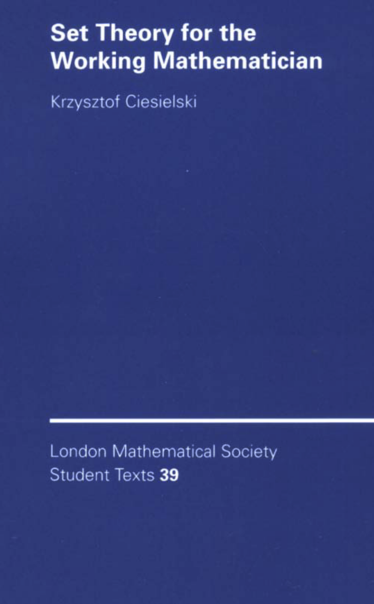

# Set theory

Set theory can be considered the foundation of modern mathematics. It provides a rigorous framework for defining and manipulating mathematical objects.

::: {.recommended-reading}

{.recommended-reading-cover fig-alt="Book or resource cover"}

This book is a widely recommended text on Zermelo--Fraenkel set theory with the axiom of choice (ZFC). It describes, in particular, encodings of "all" classical mathematical structures in terms of ZFC set theory.

:::
