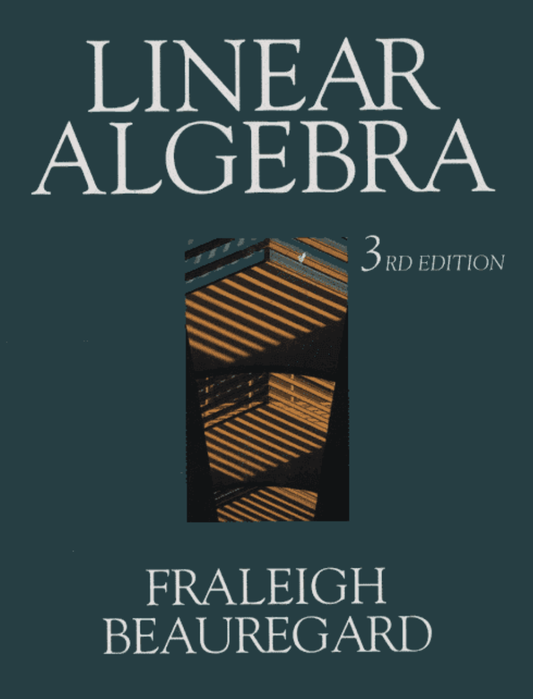
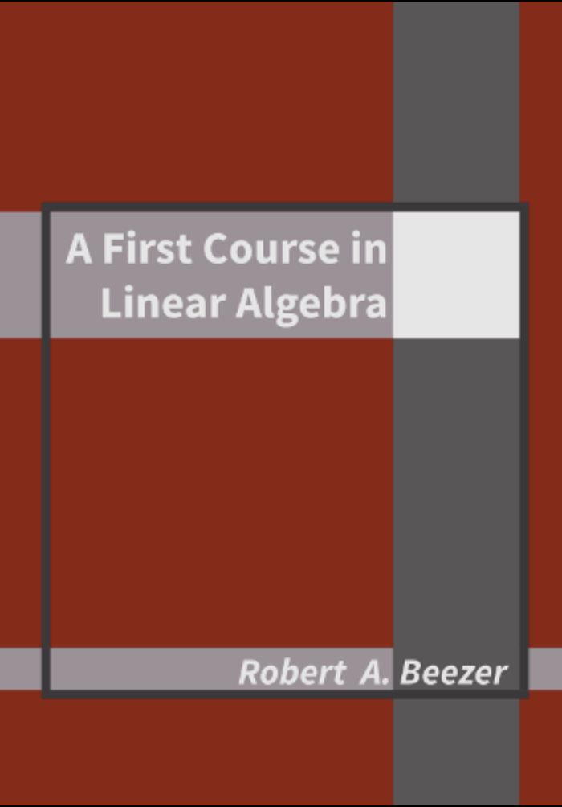
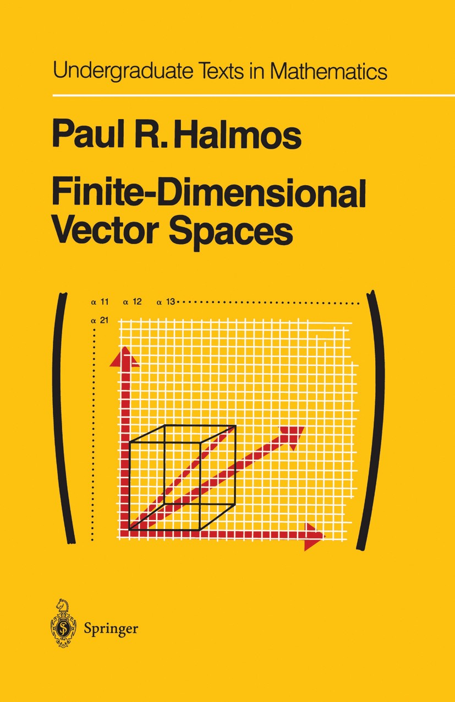

# Linear algebra {#sec-linear-algebra}

Linear algebra is perhaps the most important tool for modern science: quantum mechanics, data analysis, machine learning, ...All use linear algebra in one way or another.

::: {.recommended-reading}

{.recommended-reading-cover fig-alt="Book or resource cover"}

This was my curriculum in the first linear algebra course I took. I think it is a very good book, and highly readable. What it lacks, is the consideration of general finite dimensional linear vector spaces.

:::

::: {.recommended-reading}

{.recommended-reading-cover fig-alt="Book or resource cover"}

An online textbook in linear algebra by Robert A. Beezer can be found here: <http://linear.ups.edu/>. It is free, and also has great sets of exercises. PDF versions here: <http://linear.ups.edu/download.html>

:::

::: {.recommended-reading}

{.recommended-reading-cover fig-alt="Book or resource cover"}

This book by the great Paul Halmos is old, by very comprehensive. I find it quite readable, and have used it many times. I would consider the level to be more advanced than Fraleigh and Beauregard.

:::
