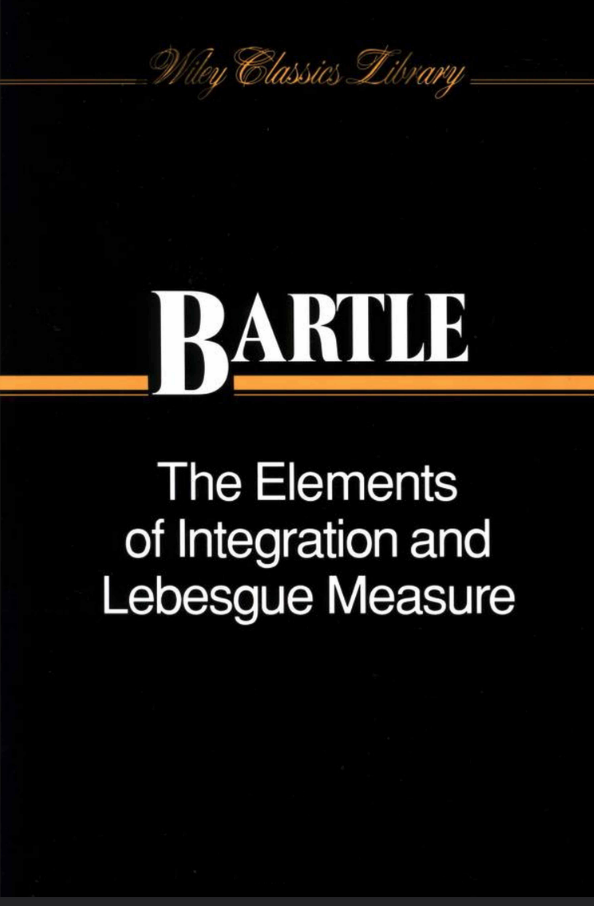
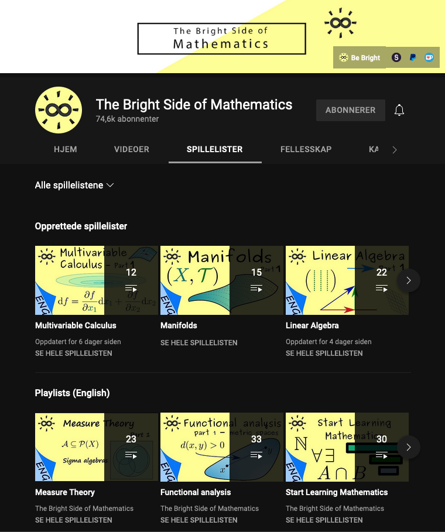

# Measure and integration theory {#sec-measure-and-integration}

Most (all?) laws of nature are formulated using *differential equations*, and in general, partial differential equations (PDEs) form a class of problems of great value to any scientist.

The Schrödinger equation for a molecule is a PDE. Its mathematically rigorous formulation relies on abstract vector spaces of *Lebesgue integrable functions*. Moreover, computing and manipulating integrals is an important task in theoretical chemistry. Thus, we here give an overview of the field *measure and integration*.

The Lebesgue integral is a generalization of the Riemann integral. Admittedly, it is rather more complicated to define, but the result is powerful results that allow us to define such things as Hilbert spaces of square integrable functions.

::: {.recommended-reading}

The slim book by Bartle is a classic in measure and integration theory. It contains all you need.

{.recommended-reading-cover fig-alt="Book or resource cover"}

:::

::: {.recommended-reading}

An excellent YouTube channel is [*The Bright Side of Mathematics*](https://www.youtube.com/c/brightsideofmaths/playlists), created by Dr. Julian P. Grossmann. Fantastic pedagogical presentation of many topics, well suited to give an intuitive impression and even more. Check out the videos on measure and integration! In fact, I based parts of my presentation of this topic on the videos.

{.recommended-reading-cover fig-alt="Book or resource cover"}

:::
