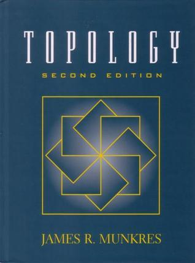
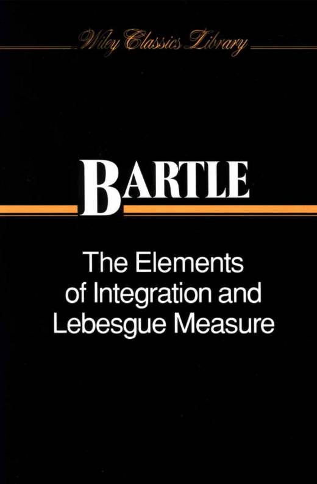
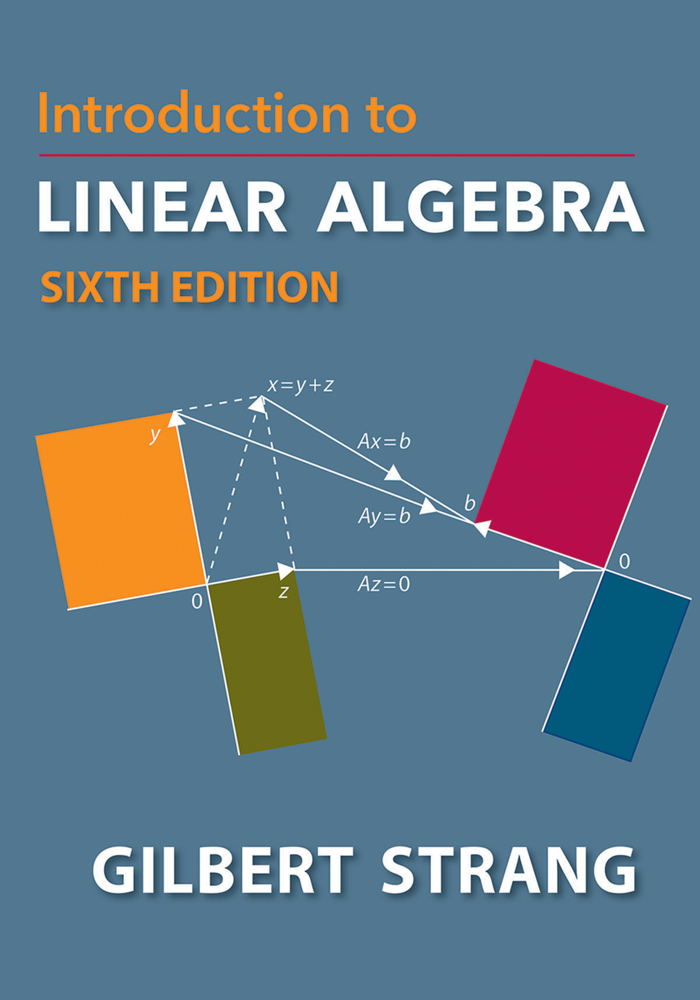
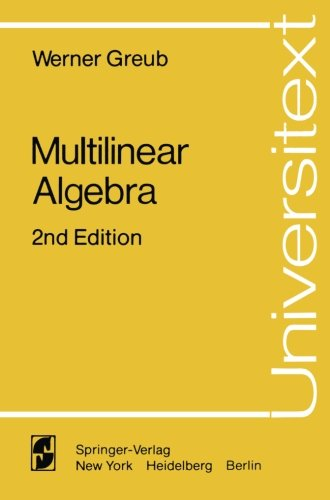
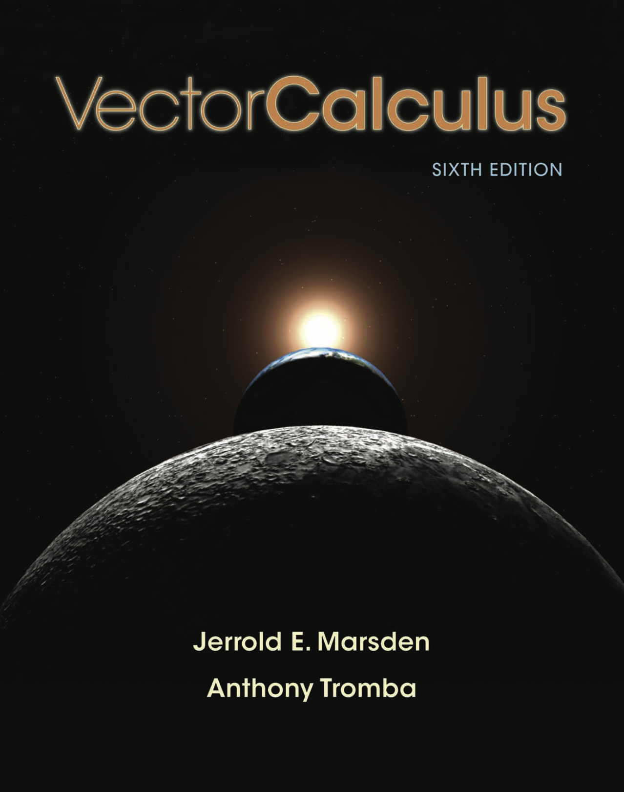
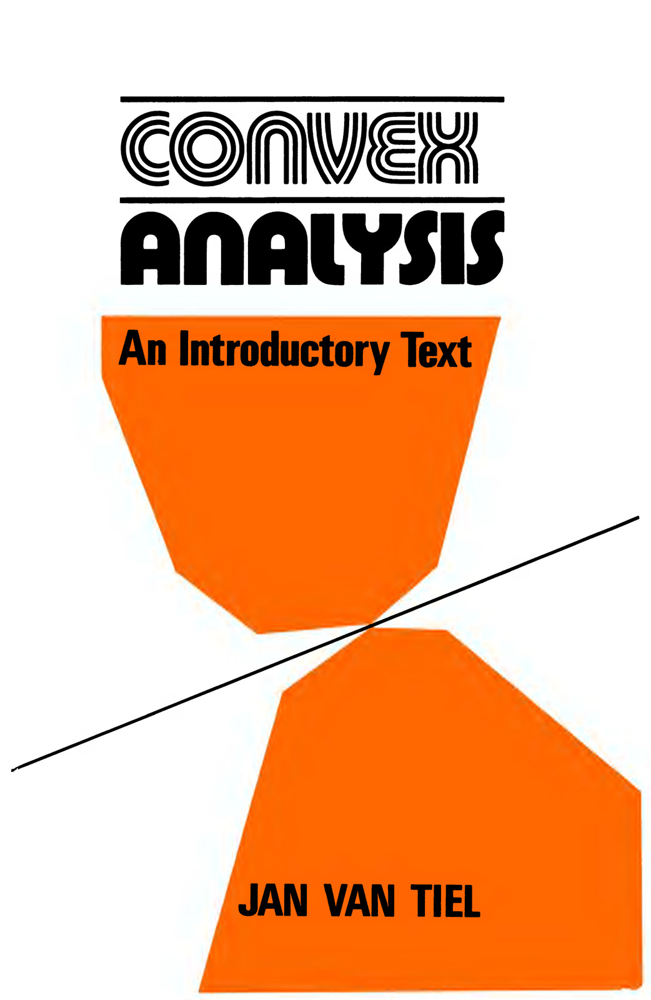
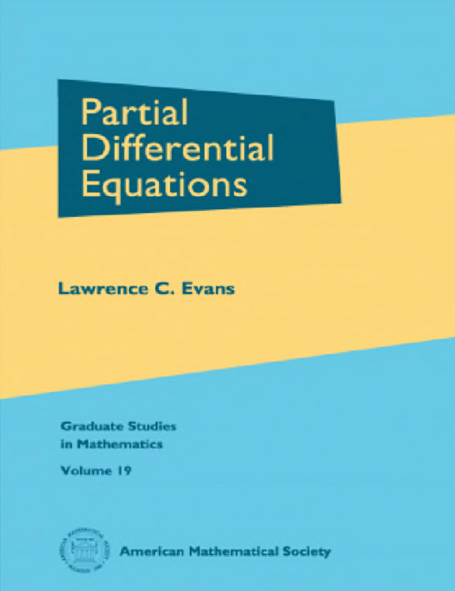

This text accompanies the Mathematics canvas. 

Each box contains one field, or topic, and they are connected to other boxes with the arrow indicating the direction from "more general" to "less general and more special". Click headings in this canvas to go to relevant sections in this note.

Of course, many more arrows could be drawn, and many more boxes could be added. In order to make the graph not too cluttered and confusing, we keep only main links.

## Ranking mathematical topics for quantum chemistry {#ranking-mathematical-topics-for-quantum-chemistry}

In the canvas, we rank mathematical topics according to how important they are for understanding and working with quantum chemistry. Let us explain what we mean, since interpreting the rankings wrongly can give the wrong impression of what knowledge is needed.

The ranking refers primarily to **conceptual understanding and the ability to apply mathematical results**, rather than to formal mathematical mastery. A quantum chemist will usually need to understand what a theorem, construction, or mathematical object means and how it can be used, but will much less often need to reproduce its formal proof, or derive new results.

+ ★ : **Core knowledge.** Mathematical concepts and techniques that every working quantum chemist should understand and be able to use. Formal mastery is not implied. Instead, the emphasis is on understanding the main ideas, interpreting the relevant mathematical objects and results, and applying them correctly in quantum-chemical contexts.

+ ◆ : **Valuable knowledge.** Mathematics that a quantum chemist should ideally be familiar with and recognize when encountered. Some working knowledge is valuable, particularly for understanding the theoretical foundations of quantum chemistry and navigating more mathematically oriented literature, but detailed technical knowledge is usually not required.

+ ◇ : **Specialized knowledge.** Mathematics that is not generally needed in quantum chemistry, but that can become useful or important in particular areas or specializations. Most quantum chemists need not study these topics systematically, if at all.

Topics **not marked** are included primarily to place the other subjects in context of the broader mathematical landscape. They are interesting and important areas of mathematics, but have comparatively little direct relevance to most quantum-chemical work.

## Logic and Set Theory ◆ {#logic-and-set-theory}

Logic is the branch of mathematics and philosophy that deals with reasoning, the principles of valid inference, and the structure of propositions, i.e., mathematical statements. It provides the formal framework used to analyze and construct mathematical proofs, ensuring that conclusions follow from premises in a valid and systematic way.

Set theory is the branch of mathematics that studies sets, which are collections of objects. In set theory, everything is a set. It forms the foundation for much (all?) of modern mathematics, providing the language and basic concepts used to describe and analyze mathematical structures. Set theory forms the foundation in the sense that every other mathematical theory can be formalized in the language of set theory.

Most mathematicians are aware of formal set theory, but the "version" used in most contexts is "naive set theory", which in a more informal manner defines mathematical sets compared to the rigorous axiom based constructions. As Russel's Paradox shows us, naive set theory has some pitfalls. Most mathematicians simply avoid these pitfalls and stick to naive set theory.

Although formal set theory is unlikely to be applied in the study of quantum chemistry, the basic notation is widely-used and an important language tool when specifying computational methods and their implementation. 

Recommended reading:

::: {.recommended-reading title="An Introduction to Proofs with Set Theory by Ashlock and Lee"}

An Introduction to Proofs with Set Theory by Ashlock and Lee

{width=300px}
Springer (2020)
https://link.springer.com/book/10.1007/978-3-031-02426-9

A in introduction to logic, set theory, and mathematical proofs for the undergraduate student. Highly recommended!

A link to the set theory chapter available online: https://www.math.uh.edu/~dlabate/settheory_Ashlock.pdf
:::

::: {.recommended-reading title="&quot;Set Theory for the Working Mathematician&quot; by Krzysztof Ciesielski"}

&quot;Set Theory for the Working Mathematician&quot; by Krzysztof Ciesielski

A more advanced text.

Cambridge University Press (1997) https://doi.org/10.1017/CBO9781139173131
:::

## Category Theory {#category-theory}

Category theory is a branch of mathematics that provides a high-level, abstract framework for describing and analyzing mathematical structures and their relationships. It was developed in the 1940s by Samuel Eilenberg and Saunders Mac Lane, and has found applications across nearly all areas of mathematics, as well as in computer science, logic, and theoretical physics.

One of the useful aspects of category theory is that it gives a rigorous language for comparing different mathematical concepts and structures, such as groups and vector spaces.

Although direct use of category theory in quantum chemistry is rare, it is mentioned here as an important branch of modern mathematics.

Recommended reading:

::: {.recommended-reading title="A Gentle Introduction to Category Theory by Maarten Fokkinga"}

A Gentle Introduction to Category Theory by Maarten Fokkinga

A set of lecture notes. Link to PDF on the author's web site:
https://maartenfokkinga.github.io/utwente/mmf92b.pdf
:::

## Discrete Mathematics ◇ {#discrete-mathematics}

Lorem ipsum ...
Recommended reading:

::: {.recommended-reading title="Concrete Mathematics by Donald Knuth"}

Concrete Mathematics by Donald Knuth

Addison-Wesley (1994)

A classic textbook.

https://en.wikipedia.org/wiki/Concrete_Mathematics
https://web.archive.org/web/20201106232418/http://www-cs-faculty.stanford.edu/~knuth/gkp.html

:::

::: {.recommended-reading title="Introduction to Graph Theory by Douglas B. West"}

Introduction to Graph Theory by Douglas B. West

{width=300px}

Link to full book (only for preview): https://daiwz.net/course/disc_math/2023/West_Intro_Graph_Theory_en.pdf

:::

## Abstract Algebra ◇ {#abstract-algebra}

In abstract algebra, sets are given *mathematical structure* in the form of binary operations and various axioms that define what it is to be, e.g., a *group*. Thus, a group is defined in terms of its essential features, and not its concrete realizations. For example, the group $\mathbb{Z}_4 = \{0, 1, 2, 3\}$ with group operation of addition modulo 4, compared to the matrix group consisting of powers of the matrix $[[0, 1], [-1, 0]]$.

Important algebraic constructions include groups, semigroups, rings, modules, vector spaces, and algebras.

Abstract algebra is important for quantum chemistry, since it lays the foundation for linear algebra, one of the most important tools of the scientist, and the study of molecular symmetries and groups.

Recommended reading:

::: {.recommended-reading title="A First Course in Abstract Algebra by John B. Fraleigh"}

A First Course in Abstract Algebra by John B. Fraleigh

Seventh Edition, Pearson (2003)
{width=300px}
Archived book: https://archive.org/details/firstcourseinabs07edfral
:::

## Group Theory ◆ {#group-theory}

Group theory is the study of abstract groups and their representations. Lie groups are groups that are also differentiable manifolds (see Differential Geometry). Group theory permeates theoretical physics and chemistry, giving an axiomatic treatment of symmetry. Representation theory studies groups represented as linear operators or matrices acting on vector spaces.

In chemistry, molecular symmetries and point groups are useful for understanding molecular behavior and also eases interpretation of spectroscopic experiments. Spectroscopic notation is a consequence of conservation of angular momentum. Representation theory is applied to explain the symmetries of molecular orbitals. Having a grasp of group theory is _absolutely essential_ for the quantum chemist.

Recommended reading:

::: {.recommended-reading title="Group Theory and Chemistry by David M. Bishop"}

Group Theory and Chemistry by David M. Bishop

{width=300px}
Dover (1973)

A classic textbook, very useful.

Link to PDF for preview:  https://library.navoiy-uni.uz/files/david%20m.%20bishop%20-%20group%20theory%20and%20chemistry%20(revised%20edition)(1993)(294s).pdf

:::

## Number Systems ★ {#number-systems}

The axiomatic definition of the natural numbers using set theory is one of the simplest examples of how set theory serves as foundation for mathematics. The natural numbers are again used to define the integers, rational numbers, real numbers, and complex numbers. These sets are of course among the most important mathematical objects in the sciences. The number systems are again examples of algebraic structures: the integers form a group under addition, the real and complex numbers form fields.

Clearly, understanding numbers is essential to any scientific study. On the other hand, for most purposes, intuitive notions about integers, reals, and complex numbers will be sufficient.

Recommended reading:

* See [Logic and Set Theory ◆](mathematics-roadmap.html#logic-and-set-theory)

## Topology ◇ {#topology}

Topology is the study of open and closed sets, and the concept of continuity. A topological space is a set together with a collection of subsets called open subsets, and axioms that these have to obey. From this, topological spaces are generated, allowing us to talk about "closeness" of elements in the set. For example, a metric is an example of a structure that gives rise to a particular kind of topology, that formalizes the notion of distance between points.

In topology the notion of sequences and their convergence is made abstract, including the notion of continuous functions. Topological arguments are indispensable for mathematical analysis of partial differential equations.

For quantum chemists, being aware of the various notions of topology is useful to navigate the literature. For example, the convergence of the pseudocontinuum of the FCI method can be formalized with topological notions. As another example, in density-functional theory, what does it mean that two electronic densities are close together? Being able to distinguish different notions of "closeness of densities" is imperative for understanding, say, modes of convergence of SCF iterations.

Recommended reading:

::: {.recommended-reading title="Topology by James R. Munkres"}

Topology by James R. Munkres

{width=300px}

Pearson (2014)

This is a classic textbook.

Link to PDF (for preview): https://people.math.ethz.ch/~dkosanovic/24-FS/Munkres-Topology.pdf

:::

## Measure and Integration ◆ {#measure-and-integration}

Measure theory develops abstract notions of length, area, volume, etc., and allows to speak about such notions in potentially very abstract spaces. For example, the Dirac delta function is rigorously defined using measure theory. 

The Lebesgue integral is based on the notion of a Borel measure, and generalizes the Riemann integral. With the Lebesgue integral we can integrate many more functions compared to the Riemann integral,  and operations like exchanging limits and integrals or integration variables obey well-defined and simple theorems. The Lebesgue integral is also necessary to define the $L^2$ Hilbert space of quantum mechanics. 

A passing knowledge if measure theory is very useful for the quantum chemist, since much of the language used in mathematical physics relies on these concepts. That being said, detailed theorems are rarely used, except in borderline cases, where apparent paradoxes may arise. In those cases, these paradoxes are resolved by checking the conditions for, say, interchange of limits and integration.

Recommended reading:

::: {.recommended-reading title="The Elements of Integration and Lebesgue Measure by Robert G. Bartle"}

The Elements of Integration and Lebesgue Measure by Robert G. Bartle

{width=300px}
Wiley Classics, 1995

A slim yet classic textbook on measure and integration.
:::

## Distribution Theory ◆ {#distribution-theory}

With distribution theory one extends the concept of functions to include objects, known as _distributions_ or _generalized functions_, which can be used to rigorously define operations like differentiation even for functions that are not classically differentiable. This theory is particularly useful in handling singularities or discontinuities, such as the Dirac delta function, which models an infinitely concentrated point of mass or charge. Distribution theory provides a powerful framework for solving partial differential equations, e.g., using Green's functions.

A rudimentary knowledge of distribution theory is very useful in the study of quantum mechanics. The standard informal view is that "the Dirac delta is a function which is infinite everywhere except at a single point where it is infinity", similarly that "the Green's function is the response of the system to a Dirac delta function", is very useful, but will only take one so far.

Useful in (for example):
- Response theory
- Manybody Green's function theory
- Electromagnetism

Recommended reading:

::: {.recommended-reading title="&quot;Mathematical Methods in Physics&quot; by Philippe Blanchard and Erwin Brüning"}

&quot;Mathematical Methods in Physics&quot; by Philippe Blanchard and Erwin Brüning

{width=300px}
:::

::: {.recommended-reading title="See also the book by [Butkov](recommended-general-mathematics-reading.html#mathematical-physics-by-butkov)"}

See also the book by [Butkov](recommended-general-mathematics-reading.html#mathematical-physics-by-butkov)

:::

## Linear Algebra ★ {#linear-algebra}

In linear algebra, one studies linear vector spaces and linear functions between such spaces. Typical, and indeed archetypal, examples are $\mathbb{R}^n$ and $\mathbb{C}^n$, and $n\times m$ matrices with complex or real entries. It is no exaggeration that linear algebra is perhaps the most important tool in science, being at the heart of everything from quantum mechanics, data analysis, and numerical methods for the solution of partial differential equations.

Having a good command of linear algebra is _absolutely essential_ to any theoretical chemist, from the LCAO approach to molecular orbitals, via practical realizations of Kohn--Sham density functional theory, to the numerical solution of, say, the coupled-cluster method.

Recommended reading:

::: {.recommended-reading title="&quot;Linear Algebra Done Right&quot; by Sheldon Axler"}

&quot;Linear Algebra Done Right&quot; by Sheldon Axler

{width=300px}

A highly regarded undergraduate text in linear algebra, considered a very fine piece of didacic writing. Open access. Available for free on the Author's web page: https://linear.axler.net/

:::

::: {.recommended-reading title="&quot;Introduction to Linear Algebra&quot; by Gilbert Strang"}

&quot;Introduction to Linear Algebra&quot; by Gilbert Strang

{width=300px}
A great book by one of the all time greats in linear algebra. See also the [Recommended YouTube channels](recommended-youtube-channels.html).  

https://bookstore.ams.org/view?ProductCode=STRANG/5

:::

## Multilinear Algebra ◆ {#multilinear-algebra}

In multilinear algebra, linear maps between vector spaces are generalized to maps over several vector spaces to several vector spaces at once, i.e., tensors. Multilinear algebra is rarely taught together with linear algebra, but could well be a subtopic in an advanced course, especially considering it is an important part of modern machine learning methodology. Multilinear algebra finds important use cases in differential geometry, as well as appearing naturally in calculus of several variables. Tensors are also integral to manybody methods like coupled-cluster theory or configuration-interaction theort.

Multilinear algebra is among the more useful topics for quantum chemists.

Recommended reading:

::: {.recommended-reading title="&quot;Multilinear Algebra&quot; by Werner Greub"}

&quot;Multilinear Algebra&quot; by Werner Greub

A springer book on multilinear algebra that I have seen recommended. I have no experience with this book myself.

Springer Verlag.
Weblink: https://link.springer.com/book/10.1007/978-1-4613-9425-9
{width=300px}
:::

::: {.recommended-reading title="&quot;Multilinear Algebra and its Applications&quot;"}

&quot;Multilinear Algebra and its Applications&quot;

Lecture notes: https://www2.math.ethz.ch/education/bachelor/lectures/fs2016/other/mla/ma.pdf 

Course web page at ETH: https://www2.math.ethz.ch/education/bachelor/lectures/fs2016/other/mla.html

The author's name is not disclosed, but the professor that taught the course in 2016 was [Prof. Dr. Özlem Imamoḡlu](https://people.math.ethz.ch/~oezlemi/)
:::

## Calculus ★ {#calculus}

Calculus is the branch of mathematics that studies continuous change and is divided into two main areas: differential calculus and integral calculus. Differential calculus focuses on the concept of the derivative, rates of change. Integral calculus, on the other hand, deals with the concept of the integral.

Multivariate calculus extends to functions of several variables, encompassing the study of partial derivatives, multiple integrals, and vector calculus. 

Calculus, together with linear algebra, forms the foundation for much of modern science. It is _absolutely essential_ to have a good grasp of calculus and multivariate calculus for theoretical chemists.

Recommended reading:

::: {.recommended-reading title="Vector Calculus by Jerrold E. Marsden and Anthony Tromba"}

Vector Calculus by Jerrold E. Marsden and Anthony Tromba

{width=300px}

:::

## Complex Analysis ◆ {#complex-analysis}

Complex analysis studies the calculus of functions of complex variables. For complex functions, being differentiable is a much more restricting requirement than for real functions, leading to surprising and very strong results of great use in physics and chemistry. Since real functions often are special cases of complex functions, complex analysis is very useful even if complex numbers do not show up at all in a theory.

Useful in: Response theory, quantum dynamics, integral evaluation, perturbation theory, to name a few.

Complex analysis is among the more useful topics for quantum chemists.

Recommended reading:

::: {.recommended-reading title="The book by [Recommended General Mathematics Reading](recommended-general-mathematics-reading.html#mathematical-physics-by-butkov) is useful."}

The book by [Recommended General Mathematics Reading](recommended-general-mathematics-reading.html#mathematical-physics-by-butkov) is useful.

:::

::: {.recommended-reading title="Complex Analysis by Theodore Gamelin"}

Complex Analysis by Theodore Gamelin

{width=300px}
Springer (2001).

A very pedagogical textbook.
:::

## Differential Geometry ◇ {#differential-geometry}

Differential geometry studies curves, surfaces, and higher-dimensional analogues from an abstract perspective, called differentiable manifolds. These are characterized by the fact that they somehow are smooth, and that locally, i.e., in for sufficiently small neighborhoods of points (if one zooms in on any point), they look like flat space, i.e., $\RR^n$ (or $\CC^n$ for complex manifolds). Thus, differential geometry combines multivariate calculus and linear algebra. One has infinite dimensional versions of the theory, as well, where the modelling spaces are infinite dimensional Banach or Hilbert spaces.

Differential geometry is very useful for abstract understanding of manybody wavefunction methods. For example, the concept of orbital invariance in CASSCF, or the manifold structure of the Hartree-Fock or coupled-cluster methods. See also lie group theory.

Differential geometry is also the foundation for general relativity, and, to a lesser extent, special relativity.

Differential geometry is among the more useful branches of mathematics for quantum chemistry students.

Recommended reading:

::: {.recommended-reading title="Geometry of Physics by Theodore Frankel"}

Geometry of Physics by Theodore Frankel

Third Edition, Cambridge University Press (2011)
A fantastic book.
Weblink: https://www.cambridge.org/core/books/the-geometry-of-physics/94894F70DB22055BD7BC2B84C135ABAF?pageNum=2&searchWithinIds=94894F70DB22055BD7BC2B84C135ABAF&productType=BOOK_PART&searchWithinIds=94894F70DB22055BD7BC2B84C135ABAF&productType=BOOK_PART&sort=mtdMetadata.bookPartMeta._mtdPositionSortable%3Aasc&pageSize=30&template=cambridge-core%2Fbook%2Fcontents%2Flistings&ignoreExclusions=true
:::

::: {.recommended-reading title="Fundamentals of Differential Geometry by Serge Lang"}

Fundamentals of Differential Geometry by Serge Lang

{width=300px}
Springer (1999)
A classic texbook.
https://link.springer.com/book/10.1007/978-1-4612-0541-8

:::

::: {.recommended-reading title="Differential Geometry of Curves and Surfaces by Manfredo do Carmo"}

Differential Geometry of Curves and Surfaces by Manfredo do Carmo

{width=300px}
Prentice-Hall (1976)

A gentle introduction to differential geometry, mostly sticking to familiar Euclidean space.

Link to PDF (for preview): http://www2.ing.unipi.it/griff/files/dC.pdf

do Carmo also has a more advanced book, "Riemannian Geometry"
{width=300px}
Birkhäuser (1992)

Weblink: https://link.springer.com/book/9780817634902

I have used this book sometimes, and it is quite good.

:::

::: {.recommended-reading title="Manifolds, Tensor Analysis, and Applications by Ralph Abraham, Jerrold E. Marsden, and Tudor Ratiu"}

Manifolds, Tensor Analysis, and Applications by Ralph Abraham, Jerrold E. Marsden, and Tudor Ratiu

{width=300px}
Springer (1988)
Weblink: https://link.springer.com/book/10.1007/978-1-4612-1029-0
Archived book: https://archive.org/details/manifoldstensora00abra_0
:::

## Convex Analysis ◇ {#convex-analysis}

Convex analysis deals with convex sets and functions. It is an important branch of mathematics, since many optimization problems in science enjoy the property of convexity. Convex analysis introduces a duality transformation, the Legendre-Fenchel transformation, which in many ways are analogous to the Fourier transform.

Convex analysis plays a prominent role in the mathematical foundation of DFT, as pioneered by E.H. Lieb. The Legendre-Fenchel transformation is also important in thermodynamics.

Convex analysis is a useful topic, especially if one wants to study DFT.

Recommended reading:

::: {.recommended-reading title="Convex Analysis - An Introductory Text by Jan van Tiel"}

Convex Analysis - An Introductory Text by Jan van Tiel

{width=300px}
Wiley (1984)

This is a slim book but highly readable!
:::

## Functional Analysis ◆ {#functional-analysis}

Functional analysis can be viewed as infinite dimensional linear algebra. Here, complete normed spaces (Banach spaces) and complete inner product spaces (Hilbert spaces) are studied, along with linear operators between such spaces. Functional analysis is the foundation of quantum mechanics, as done by J. von Neumann. In a way, one can say that the development of functional analysis in the early 20th century was motivated by placing quantum mechanics on rigorous ground.

Functional analysis also provides the mathematical language for abstract treatment of PDEs such as the Schrödinger equation, the Kohn--Sham approach to DFT, Maxwell's equations, and so on.

Functional analysis is a very useful topic for quantum chemists, especially when you want to navigate the more mathematics heavy literature.

Recommended reading:

::: {.recommended-reading title="Introductory Functional Analysis with Applications by Erwin Kreyszig"}

Introductory Functional Analysis with Applications by Erwin Kreyszig

{width=300px}
:::

## Calculus of Variations ★ {#calculus-of-variations}

Calculus of variations deals with the optimization of nonlinear functionals, functions that map _functions_ to scalars. Calculus of variations generalizes vector calculus to infinite dimensions, and as such could also be called "nonlinear functional analysis". Calculus of variations is the correct framework for variational formulations of the laws of nature, from quantum field theory and QED to Hamilton's equations of motion. Moreover, nonlinear approximations to the molecular Schrödinger equation such as Hartree-Fock is naturally formulated in this language.

To have a basic grasp of calculus of variations is almost essential to quantum chemists. A basic knowledge does not require advanced functional analysis, even if the above paragraph gives such an expression.

Calculus of variations is thus an exceedingly important topic in quantum chemistry.

Recommended reading:
- Goldstein, Safko and Poole, "Classical Mechanics"
- Zeidler, "Nonlinear functional analysis"
- ...

## Ordinary Differential Equations ★ {#ordinary-differential-equations}

Ordinary differential equations (ODEs) describe initial value and boundary value problems of scalar quantities, or coupled such equations. From classical mechanics to rate equations, ODEs permeate theoretical chemistry, and having a basic understanding of essential mathematical results is absolutely essential.

Recommended reading:
* ...

## Partial Differential Equations ◆ {#partial-differential-equations}

Partial differential equations (PDEs) generalize ODEs to infinite dimensions, i.e., initial and boundary value problems where the unknown is no longer a scalar or a vector, but an element in a function space. Laws such as Einstein's gravitation theory, transport of heat, chemical reaction-diffusion systems, Maxwell's equations, the various Schrödinger equations, are all PDEs.

PDEs are very important for quantum chemistry.

Recommended reading:

::: {.recommended-reading title="Partial Differential Equations by Lawrence C. Evans"}

Partial Differential Equations by Lawrence C. Evans

{width=300px}
Second Edition, American Mathematical Society (2010)
A popular textbook in PDEs.
Link to PDF (for preview): http://home.ustc.edu.cn/~wclw8181/wffc.files/Partial%20Differential%20Equations.Evans.pdf
:::

::: {.recommended-reading title="Functional Analysis, Sobolev Spaces, and Partial Differential Equations by Haim Brezis"}

Functional Analysis, Sobolev Spaces, and Partial Differential Equations by Haim Brezis

{width=300px}
Springer (2011)
A highly readable book focusing on an abstract framework for PDEs.
Weblink: https://link.springer.com/book/10.1007/978-0-387-70914-7
:::

 

## Operator Algebra ◇ {#operator-algebra}

In operator algebra, one studies algebras of operators over linear spaces, often Hilbert spaces. The algebras are often given structures inspired by quantum mechanics, such as canonical anticommutator or canonical commutator relations, e.g. the CAR and CCR algebras. It is a highly abstract branch of pure mathematics, and understanding the basic notions and results may be very useful for the study of manybody theory and quantum field theories.

Recommended reading:

::: {.recommended-reading title="Operator Algebras and Quantum Statistical Mechanics by Ola Bratteli and Derek W. Robinson"}

Operator Algebras and Quantum Statistical Mechanics by Ola Bratteli and Derek W. Robinson

{width=300px}
Springer (1987)
A classic textbook, but quite dense, in my opinion.
Weblink: https://link.springer.com/book/10.1007/978-3-662-02520-8
:::

::: {.recommended-reading title="A Course in Operator Theory by John B. Conway"}

A Course in Operator Theory by John B. Conway

{width=300px}
American Mathematical Society (1999)
Link: https://bookstore.ams.org/GSM/21
"This is an excellent course in operator theory and operator algebras ... leads the reader to deep new results and modern research topics ... the author has done more than just write a good book—he has managed to reveal the unspeakable charm of the subject, which is indeed the ‘source of happiness’ for operator theorists."  - _Mathematical Reviews_
:::

::: {.recommended-reading title="A list of books for students studying operator algebras"}

A list of books for students studying operator algebras

Link: https://math.vanderbilt.edu/peters10/students.html

:::

- See also [Recommended General Mathematics Reading](recommended-general-mathematics-reading.html#mathematical-methods-in-physics-by-blanchard-and-br%C3%BCning)

## Probability and Statistics ★ {#probability-and-statistics}

Probability theory provides the mathematical framework for describing random variables, probability distributions, expectation values, correlations, and stochastic processes. Statistics uses probability theory to draw conclusions from data and to quantify uncertainty.

Probability and statistics are increasingly important in quantum chemistry. They are central to Monte Carlo methods, including variational and diffusion Monte Carlo, and to the analysis of stochastic numerical methods. Statistical ideas are also needed for uncertainty quantification, error analysis, fitting models to data, and the interpretation of computational and experimental results. In addition, probability and statistics form part of the mathematical foundation of modern machine learning methods used in chemistry.

At a basic level, a quantum chemist should be comfortable with probability distributions, expectation values, variance and covariance, conditional probability, and elementary statistical estimation. More specialized areas may require stochastic processes, Bayesian methods, Markov chains, and Monte Carlo sampling.

Recommended reading:
* ...

## Numerical Analysis ★ {#numerical-analysis}

Most equations in quantum chemistry cannot be solved analytically, and must be approximated in finite precision arithmetic on computers. This is the area of numerical analysis. Here, numerical methods for differential equations are studied, as well as numerical linear algebra and eigenvalue finding algorithms, to name some topics.

Numerical analysis is very important for developing and understanding computer implementations of quantum chemistry algorithms.

Recommended reading:

::: {.recommended-reading title="Numerical Analysis by Francis B. Hildebrand"}

Numerical Analysis by Francis B. Hildebrand

{width=300px}
Dover (1956)
Archived version: https://archive.org/details/introduction_to_numerical_analysis_hildebrand

A classic textbook.
:::

::: {.recommended-reading title="Fundamentals of Numerical Computation by Tobin A. Driscoll and Richard J. Braun"}

Fundamentals of Numerical Computation by Tobin A. Driscoll and Richard J. Braun

{width=300px}
SIAM

A modern textbook of very high quality also available completely for free online. Python, MATLAB, and Julia versions.
Link: https://tobydriscoll.net/book/fnc/index.html
Complete book: https://tobydriscoll.net/fnc-julia/frontmatter.html

:::

## Optimization and Root Finding ★ {#optimization-and-root-finding}

Optimization, really a subfield of numerical analysis, deals with finding local or global extremal points of functions of several variables, as well as finding roots of systems of nonlinear equations. There are a multitude of algorithms, such as the method of steepest descent, Newton, and quasi-Newton methods. A very important topic for students of quantum chemistry, as many computational problems end up as an optimization problem.

Recommended reading:

::: {.recommended-reading title="Numerical Optimization by Jorge Nocedal and Stephen J. Wright"}

Numerical Optimization by Jorge Nocedal and Stephen J. Wright

{width=300px}
Springer (2006)
Link to PDF (for preview): https://www.math.uci.edu/~qnie/Publications/NumericalOptimization.pdf
Link: https://link.springer.com/book/10.1007/978-0-387-40065-5

This is an excellent book which I have used a lot.

:::
